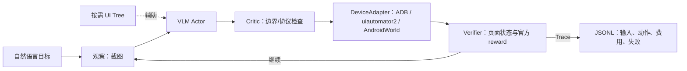

# MobilePilot：可审计的 Android GUI Agent Runtime

MobilePilot 将视觉语言模型的结构化动作接入真实 Android Runtime：截图/可选 UI Tree → VLM Actor → Critic → ADB 或 AndroidWorld 执行 → Verifier/Recovery → JSONL Trace。核心定位是**视觉决策为主、UI Tree 按需辅助、执行与成功由真实 Android 环境验证**。



## 已真实完成

- 真机：ADB、uiautomator2、中文输入、按需 UI Tree、视觉 fallback 与可审计 Trace；
- 单步公共评测：ScreenSpot-v2 Mobile 固定发布物的 471 条 held-out，Raw 70.49%，10×10 Grid 66.67%；差异不支持“网格更优”的结论；
- 多步公共评测：AndroidWorld 固定 20 题子集，`vision_only` 5/20，`hybrid` 4/20；AndroidWorld 官方 reward 为唯一成功判定，差异不显著；
- 工程：多步 `CLICK/TYPE/SWIPE/BACK/OPEN_APP/WAIT/PROPOSE_COMPLETE`、输出解析、官方 completion 拒绝、成本门禁、断点续跑和 96 项离线测试。

## 结果必须分开看

| 证据层 | 目的 | 结果与边界 |
| --- | --- | --- |
| 自建 MobilePilot Lab | 受控消融与真实设备闭环 | 8任务×7配置×3次；10×10 pure vision 为24/24，仅代表该受控 App。 |
| ScreenSpot-v2 Mobile | 单步 GUI grounding 泛化 | 471 held-out：Raw 332/471，Grid 314/471；不能声称网格泛化收益。 |
| AndroidWorld | 多步任务完成 | 固定20题：纯视觉5/20、混合4/20；不是116类完整成绩。 |

详细数字见 [实验总表](docs/final/evaluation-summary.md)，成功/失败证据见 [代表性 Trace](docs/final/representative-traces.md)。

## 可复现 Demo

环境、模型变量、真机边界、AndroidWorld 命令和三分钟讲解脚本见 [Demo 指南](docs/final/demo-script.md)。正式 AndroidWorld 产物保留在本地 `artifacts/evaluation/androidworld-held-out-20260731/`，不会提交大体积 Trace 或凭证。

## 项目结构

```text
mobile_pilot/androidworld/  # AndroidWorld Adapter、Actor、Agent、冻结清单
mobile_pilot/evaluation/    # ScreenSpot-v2 等评测入口
scripts/                    # 单题、批量与环境脚本
docs/progress/              # 各阶段真实进度与结果
docs/final/                 # Demo、Trace、实验总表、简历候选描述
```

## 当前局限

复杂表单、日历、跨 App 长任务仍常耗尽步数；当前 Critic/Recovery 在 AndroidWorld 20题正式运行中没有实际修复案例。MobilePilot 的价值是把这些失败完整暴露、可复现和可分析，而非包装成通用手机自动化成功率。

## License

项目特定实现采用 [MIT License](LICENSE)。
