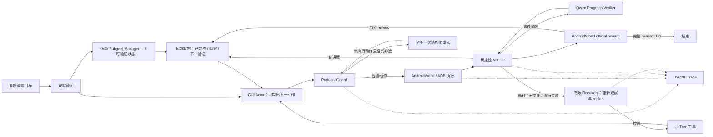

# MobilePilot：可审计的 Android GUI Agent Runtime

MobilePilot 不是训练 GUI 模型，而是研究一个更贴近真实 Agent 工程的问题：

> 当 VLM 输出不稳定、页面没有变化、动作开始重复，或模型错误地认为任务完成时，
> Runtime 如何发现失败、保存进度、有限重规划，并用真实环境给出可审计结论？

项目将截图、GUI-Plus、AndroidWorld/ADB 执行、按需 UI Tree、官方 reward 和 JSONL
Trace 串成多步闭环。目标不是展示“手机 UI 能点起来”，而是让失败处理、工具选择、
终止判断和实验边界都能被验证。

**技术栈：** Python · AndroidWorld · ADB · Android Emulator · uiautomator2 ·
Accessibility UI Tree · OpenAI-compatible VLM API · JSONL Trace · pytest · Git/GitHub

## 从哪里遇到困难

V1 在已冻结的 AndroidWorld 20 题上只完成 `vision_only 5/20`、`hybrid 4/20`。
40 条 Trace 中只有 9 条完整成功；31 条失败的终止原因是：

| 失败终止 | 次数 | 暴露的问题 |
| --- | ---: | --- |
| 非法 Actor 输出 | 21 | 空响应、超时、JSON/字段错误、未知动作会让任务直接退出 |
| 步数耗尽 | 7 | 长任务容易忘记进度，或在错误页面持续尝试 |
| 模型误报完成 | 2 | “模型说完成”不能替代环境验证 |
| 动作执行失败 | 1 | App 名称、页面状态或执行接口可能不满足动作前提 |

这 20 题后来参与了失败分析和 V2 开发，因此现在只称为**开发/回归集**；历史目录名
`androidworld-held-out-20260731` 不再代表未见评测。

## V2 做了什么



### 1. Protocol Guard：让接口可靠

- 归一化无歧义动作别名、校验 schema；
- 只有在动作尚未执行时，允许至多一次安全结构化重试；
- 不修复可能改变文本语义或导致危险重复的模糊输出。

这是协议兼容与工程可靠性，**不是 Agent 推理能力**。

### 2. Agent Recovery：失败后有限改路

- 记录已完成动作、当前阻塞和下一步验证目标；
- 检测第三次相似动作、ABAB 循环、连续页面无变化和页面重访；
- 每个任务最多触发一次 Recovery，重新观察后要求改变动作路线；
- 若仍重复同一不确定动作，在执行前停止，避免无限乱点。

### 3. UI Tree 从“每步输入”改为“按需工具”

V1 hybrid 每一步都附带 Tree。V2 只有在非法输出、动作失败、连续无变化、循环或模型
主动请求时才读取 Tree。Trace 记录触发原因、Tree 摘要、是否改变动作及是否最终救回。

### 4. 官方 reward 控制最终完成

`PROPOSE_COMPLETE` 只是模型提议。Runtime 每步查询 AndroidWorld 官方 reward；模型漏报
时仍可判成功，模型误报时仍记失败。组合任务的 `0.5` 只记为部分完成并继续执行，只有
`reward >= 1.0` 才是完整成功。

## 结果：开发集提升，但未证明未见泛化

### 暴露 20 题开发回归

模型、seed、12 步预算和 hybrid 模式保持一致：

| 指标 | V1 | V2 | 变化 |
| --- | ---: | ---: | ---: |
| 官方完整成功 | 4/20 | 9/20 | +5 题 |
| 非法输出终止 | 13/20 | 7/20 | -6 题 |
| 步数耗尽终止 | 2/20 | 1/20 | -1 题 |
| 平均动作数 | 4.05 | 5.60 | +1.55 |
| VLM 调用 | 94 | 144 | +50 |
| 估算目录价 | ¥0.6596 | ¥0.7969 | +¥0.1373 |

逐题配对为 6 题改善、1 题退化、3 题都成功、10 题都失败。Recovery 触发 10 次，
其中 3 次形成了“失败信号 → Tree/重新规划 → 改变动作 → 官方 reward”的真实救回：
`SystemBluetoothTurnOn`、`SystemWifiTurnOff`、`MarkorCreateFolder`。

### V2.2：职责拆分改善协议，但没有超过 V2

V2.2 将高频 GUI-Plus Actor 收窄为 action-only 工具调用；Qwen 只在边界生成一个冻结
子目标，并在确定性证据不足或疑似停滞时充当 Progress Verifier。原 20 题仍只作开发集：

| 指标 | V2.2 最佳开发回归 | Manager 边界消融 |
| --- | ---: | ---: |
| 完整成功 | 7/20 | 5/20 |
| 部分完成 | 0 | 1 |
| 非法输出终止 | 1 | 1 |
| Recovery 触发 / 救回 | 20 / 1 | 27 / 1 |
| 平均动作数 | 6.15 | 6.85 |
| VLM 调用 | 217 | 274 |
| 估算目录价 | ¥0.8654 | ¥1.1257 |

最佳开发回归中，`ExpenseDeleteSingle` 首次形成了可审计的“连续无进展 → 按需 Tree →
改变动作 → 官方 reward=1.0”救回；组合任务 `TurnOnWifiAndOpenApp` 也从上一轮错误提前停在
`0.5`，修正为继续执行并获得 `1.0`。但 V2.2 的 7/20 仍低于 V2 的 9/20，因此不能写成
成功率升级。更严格拒绝操作型子目标的消融回落到 5/20+1 partial，代码已回退，Trace
保留为负结果。

### 新冻结任务：评测未完整，已完成子集没有收益

新任务评测严格排除开发题、固定 Agent 源码 hash，并禁止单题重试。运行中先后暴露了
Windows TLS、模拟器缺少 `-grpc 8554`、Joplin SQLite 缺少 `fts4` 等基础设施问题。
原始中断产物全部保留。

最终批次完成 6 个有效 V1/V2 配对后被第 7 题的 Joplin 初始化错误永久暂停：

| 已完成的冻结子集 | V1 | V2 |
| --- | ---: | ---: |
| 完整成功 | 2/6 | 1/6 |
| 非法输出终止 | 1 | 2 |
| 步数耗尽 | 3 | 0 |
| 执行动作 | 49 | 22 |
| VLM 调用 | 51 | 32 |
| 估算目录价 | ¥0.3195 | ¥0.1739 |
| Recovery 触发 / 救回 | 0 / 0 | 2 / 0 |

这 6 对任务不是完整 12 题成绩，也不能称为 AndroidWorld 泛化结论。它只说明：V2 在
该未见子集上减少了重复动作和调用成本，但成功数从 2 降到 1，**没有复现开发集收益**。

## 走过但没有继续投入的方向

| 尝试 | 真实结果 | 为什么停止 |
| --- | --- | --- |
| 10×10 网格 | 自建受控 App 中 24/24；ScreenSpot-v2 从 Raw 70.49% 降到 Grid 66.67% | 只在受控界面有效，未证明公开泛化，不再优化坐标方案 |
| 每步 UI Tree | AndroidWorld V1 hybrid 4/20，未优于 vision-only 5/20 | Tree 会增加上下文，但不会自动带来正确任务规划，V2 改为按需调用 |
| 更换 GUI-Plus 主版本 | 小规模开发任务未显示稳定优势，且坐标约定不同 | 固定 `gui-plus-2026-02-26`，避免把模型变化与 Runtime 改进混在一起 |

这些负结果不是被删除的“弯路”，而是后续把工作重心从视觉技巧转向 Agent 状态、
恢复和审计的依据。

## 证据分层

| 证据层 | 规模 | 结论边界 |
| --- | --- | --- |
| MobilePilot Lab | 8 任务 × 7 配置 × 3 次 = 168 runs | 受控 App 消融，不代表公开泛化 |
| ScreenSpot-v2 Mobile | 471 条公开 held-out | Raw 332/471，Grid 314/471；网格无泛化收益 |
| AndroidWorld V1 | 暴露 20 题 × 2 模式 = 40 runs | 历史冻结结果，现仅作开发基线 |
| AndroidWorld V2 开发回归 | 同一暴露 20 题，hybrid 配对 | 4/20 → 9/20，仅说明定向改进有效 |
| AndroidWorld V2.1 Planner 消融 | 同一暴露 20 题 | 5/20，低于 V2；Planner 未带来收益 |
| AndroidWorld V2.2 分层执行 | 同一暴露 20 题 | 最佳 7/20、1 次真实救回；协议更稳但未超过 V2 |
| AndroidWorld 新冻结任务 | 6 个完整配对后基础设施中断 | V1 2/6、V2 1/6；不包装成完整 held-out 成绩 |
| AndroidWorld 新冻结 36 题 | 36 题、计划 72 个配对运行 | 协议已冻结、尚未运行；不得提前写结果 |

详细数字见 [实验总表](docs/final/evaluation-summary.md)，Recovery 成功与失败链路见
[代表性 Trace](docs/final/representative-traces.md)，三分钟讲解见
[Demo 指南](docs/final/demo-script.md)。

## 可复现运行

本轮只允许 AndroidWorld 模拟器，不连接真实手机。模拟器必须同时固定 ADB 和 gRPC：

```powershell
$emulator='C:\Users\Admin\AppData\Local\Android\Sdk\emulator\emulator.exe'
Start-Process -FilePath $emulator -ArgumentList @(
  '-avd','AndroidWorldAvd','-port','5554','-grpc','8554','-no-snapshot-save'
)

$env:MOBILEPILOT_ACTOR_MODEL='gui-plus-2026-02-26'
$env:MOBILEPILOT_ANDROIDWORLD_DOWNLOAD_CACHE=(Resolve-Path '.local\androidworld-download-cache').Path
```

冻结评测 Runner 会在模型调用前检查：唯一设备必须是 `emulator-5554`、AndroidWorld
commit、模型、任务 hash、Agent 源码 hash、tracked workspace、本地官方缓存、调用预算
和成本上限。当前完整离线回归为 `170 passed`。完整命令见
[Demo 指南](docs/final/demo-script.md)。

## 项目结构

```text
mobile_pilot/androidworld/
  actor.py          # VLM 调用、结构化动作与 Protocol Guard
  agent.py          # 多步闭环、状态、Verifier、按需 Tree 与 Recovery
  runtime_state.py  # 轻量进度、循环检测、恢复预算
  adapter.py        # AndroidWorld 动作执行适配
scripts/
  run_mobilepilot_androidworld.py   # 单任务官方 reward 闭环
  run_androidworld_runtime_eval.py  # 冻结、预算、配对与指标汇总
docs/progress/       # 每个 Sprint 的假设、结果与失败证据
docs/final/          # 实验总表、代表 Trace、Demo 与简历描述
```

## 当前局限

> 2026-08-10 结果：V2.2 使用 action-only GUI Actor、低频 Qwen Subgoal Manager、
> 确定性优先的两层 Verifier 和最多两级 Recovery。在暴露开发集最佳为 7/20，并出现
> 1 次真实救回，但仍低于 V2 的 9/20。更严格的 Manager 边界消融回落到 5/20+1 partial，
> 已保留证据并回退代码。详见
> [Sprint 16 结果](docs/progress/androidworld-v22-sprint16-development-result.md)。

- 新冻结评测没有完整跑满 12 题，不能声称 V2 已获得 held-out 泛化提升；
- 新的 36 题 V1/V2.2 配对协议已冻结但尚未运行，当前没有新泛化数字；
- 两级 Recovery 仍不足以稳定处理多字段表单、Markor 对话框和日历长任务；
- V2.2 最佳开发回归 Recovery 触发 20 次仅救回 1 次，纠偏质量仍是主瓶颈；
- AndroidWorld 部分 App 在 Windows 上存在 snapshot、Activity 或 SQLite 兼容问题；
- 目录价是基于记录 Token 的估算值，不等同于账单实扣。

MobilePilot 当前最可靠的价值不是一个漂亮的总分，而是：把 GUI Agent 的协议失败、
状态失控、循环、恢复、工具调用和官方验证做成了可运行、可审计、可复盘的工程闭环。

## License

项目特定实现采用 [MIT License](LICENSE)。
