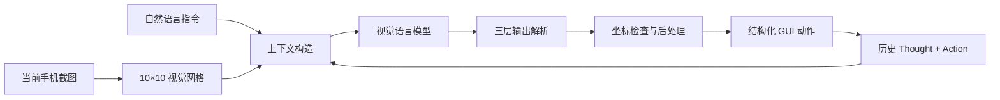
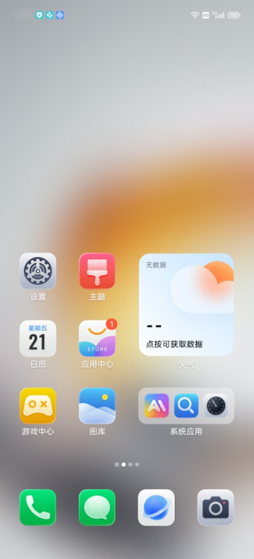
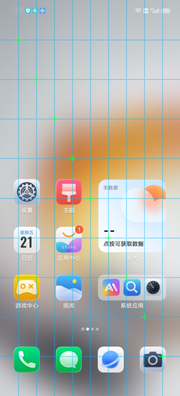

<div align="center">

# Mobile GUI Agent

**让视觉模型根据手机截图与自然语言指令，逐步生成可执行的 GUI 动作。**

[](https://www.python.org/)
[](#系统架构)
[](#动作空间)
[](#快速开始)

</div>

## 项目简介

Mobile GUI Agent 接收一条用户指令和当前手机截图，通过视觉语言模型理解页面状态、回顾历史操作，并输出下一步结构化动作。

例如，面对“去美团搜索附近的咖啡店”这样的指令，Agent 会逐步完成：

```text
OPEN 美团 → CLICK 搜索框 → TYPE 咖啡 → CLICK 搜索按钮 → COMPLETE
```

这个项目关注的不只是“调用视觉 API”，而是 GUI Agent 在长链路任务中的稳定性：如何让模型找准坐标、记住已经做过的动作、稳定输出机器可解析的格式，并在异常输出时安全降级。

> 当前仓库实现的是“截图到动作”的决策层和离线评测流程，尚未集成 ADB 或真实设备执行器。

## 系统架构



每轮 API 请求只发送当前截图；历史图片不会重复上传，过去的操作则压缩为文本语义记忆。

## 核心设计

### 1. 视觉网格辅助定位

在原始截图上叠加半透明网格，让抽象的 `[0, 1000]` 坐标变成模型可以直接观察的视觉参照。九条横线和九条竖线分别对应坐标 `100, 200, ..., 900`，交点使用小型十字准星强化定位。

| 原始截图 | 网格辅助后 |
|---|---|
|  |  |

实现位置：[agent.py](agent.py) 中的 `_preprocess_image()`。

### 2. 单轮截图 + 文本语义记忆

Agent 不堆叠历史截图，而是把过去的推理和动作整理为可读叙事：

```text
第1步: [想]需要先打开目标应用 → [做]OPEN "美团"
第2步: [想]搜索入口位于顶部 → [做]CLICK 坐标[870, 50]
```

这样既控制视觉 Token 消耗，也让模型知道“为什么做过这一步”，减少重复点击和流程迷失。

### 3. 归一化坐标与后处理

所有点击和滑动坐标统一映射到 `[0, 1000]`。模型输出后还会经过三层保护：

- 检测模型高频输出的可疑“安全中心点”；
- 根据 Thought 中估算的元素边界把坐标向区域内部修正；
- 对屏幕顶部和底部的极端 Y 坐标做边缘保护。

### 4. 三层容错解析

[utils/output_parser.py](utils/output_parser.py) 将模型文本转换为标准动作：

1. 解析标准 `Action: CLICK | {...}` 格式；
2. 兼容基础函数式动作格式；
3. 无法可靠解析时返回 `COMPLETE`，避免错误点击破坏后续状态。

解析器同时处理常见 JSON 小错误，并对坐标进行范围钳位。

## 动作空间

| 动作 | 参数示例 | 含义 |
|---|---|---|
| `CLICK` | `{"point": [870, 50]}` | 点击归一化坐标 |
| `TYPE` | `{"text": "咖啡"}` | 输入文本 |
| `SCROLL` | `{"start_point": [500, 800], "end_point": [500, 300]}` | 执行滑动 |
| `OPEN` | `{"app_name": "美团"}` | 打开应用 |
| `COMPLETE` | `{}` | 任务结束 |

一段完整的结构化 Trace 见 [assets/example-trace.json](assets/example-trace.json)。

## 快速开始

### 1. 安装环境

```bash
python -m venv .venv
# Windows PowerShell
.venv\Scripts\Activate.ps1
pip install -r requirements.txt
```

### 2. 配置模型 Key

复制 `.env.example` 中的变量名，并在当前终端设置真实值：

```powershell
$env:VLM_API_KEY="your_volcengine_ark_api_key"
```

项目不会从仓库中的 `.env` 自动读取密钥。

### 3. 运行网络无关测试

```bash
python -m pytest -q
```

这些测试覆盖动作解析、视觉网格和坐标后处理，不会调用模型 API。

### 4. 运行离线任务评测（需要 API）

```bash
python test_runner.py --data_dir ./test_data/offline
```

评测器会逐步读取截图与参考状态，调用 Agent，并将结果写入本地 `output/`。模型调用会产生费用，请先检查账户和限额。

## 项目结构

```text
mobile-gui-agent/
├── agent.py                 # Agent 决策、视觉网格、历史与坐标后处理
├── agent_base.py            # Agent 接口与模型调用封装
├── test_runner.py           # 离线任务评测器
├── utils/
│   ├── output_parser.py     # 模型输出解析
│   ├── prompt_general.txt   # 通用 System Prompt
│   ├── prompt_special.txt   # 历史特殊场景规则
│   └── visualize_ref.py     # 评测结果可视化
├── tests/                   # 网络无关单元测试
├── test_data/offline/       # 11 个离线 GUI 任务
├── assets/                  # README 展示素材与示例 Trace
└── docs/                    # 架构、实验和失败案例说明
```

## 实验与迭代

开发过程中围绕 Prompt 长度、API 限流、JPEG/PNG、Self-Correction、输出解析策略和场景规则进行过多轮实验。最终保留的是更短、更可控的单次决策链路；一些看似“更智能”的复杂机制反而会放大模型随机性。

- [架构与数据流](docs/architecture.md)
- [实验与技术决策](docs/experiments.md)
- [失败案例与反思](docs/failure-analysis.md)

## 项目来源

项目最初开发于中兴移动端 GUI Agent 比赛，比赛提供了 Agent 接口、离线任务格式与本地评测框架。本仓库在此基础上实现并整理了 Agent 决策逻辑、Prompt、视觉网格、输出解析、坐标后处理和实验分析。

## 局限与后续方向

- 当前只负责动作决策，没有直接连接 Android 真机执行。
- 离线任务规模较小，尚不能代表开放世界手机环境。
- 视觉模型输出存在随机性，单次评测无法完整反映稳定性。
- 特殊场景规则仍混合在 Prompt 中，未来可拆成可配置策略层。

下一步计划加入 ADB/Appium 执行器、自建公开数据集、重复运行统计和更多跨应用任务，把展示原型继续演进为可实际操作手机的 GUI Agent。

## License

项目特定实现采用 [MIT License](LICENSE)。比赛方提供的基础框架归属说明见 [NOTICE.md](NOTICE.md)。

