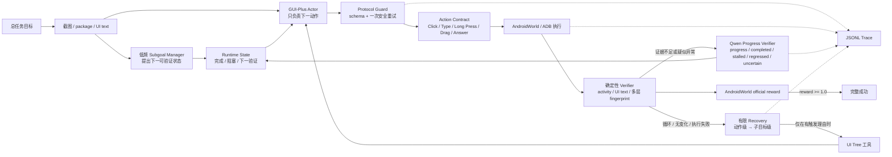

# MobilePilot：可审计的 Android GUI Agent Runtime

MobilePilot 不训练 GUI 模型。它解决的是一个更像真实 Agent 工程的问题：

> 当 VLM 输出不稳定、动作能力不完整、页面没有进展或策略开始重复时，Runtime 如何保存状态、验证进度、按需使用工具、有限纠偏，并用真实环境留下可审计证据？

项目把截图、GUI Actor、AndroidWorld/ADB、按需 UI Tree、官方 reward 和 JSONL Trace 串成多步闭环。重点不是“手机界面能点起来”，而是让失败管理、工具选择、恢复边界和评测结论都能复盘。

**技术栈：** Python · AndroidWorld · ADB · Android Emulator · uiautomator2 · Accessibility UI Tree · OpenAI-compatible VLM API · JSONL Trace · pytest · Git/GitHub

## 项目故事：从“怎么死”追到“为什么走错”

最初 V1 在固定 20 题上得到 `vision_only 5/20`、`hybrid 4/20`。40 条运行只有 9 条成功，31 条失败中有 21 条直接死于非法 Actor 输出。

Trace 审计后发现问题分成三层：

1. **协议和执行层不完整**：空输出、坏 JSON、未知动作会直接结束；Runtime 缺少 long press、定点 drag 和官方 answer 通道。
2. **状态流转容易误杀**：已经出现语义进展，旧页面的 unchanged/loop 状态仍可能把任务送进 Recovery。
3. **Recovery 有触发、没纠偏**：旧版本能发现页面没变化，却经常只 wait、重复动作或随机换动作，没有新证据。

因此改进没有继续堆 Planner 或视觉技巧，而是沿着：

`Trace → failure taxonomy → root cause → minimal fix → development regression → frozen paired evaluation`

做了一轮可回退、可验证的 Runtime 修复。

> 原 20 题后来参与了 RCA 和调试，现在只称为**开发/回归集**。历史目录名里的 held-out 不再代表未见评测。

## Runtime 架构



### 1. Protocol Guard 和 Agent Recovery 分开

Protocol Guard 只处理无歧义的接口问题：动作别名归一化、schema 校验，以及“尚未执行动作”时的一次结构化重试。它不会把 `LONG_PRESS` 偷偷降级成 `CLICK`，也不会把协议修复包装成推理能力。

Agent Recovery 处理的是执行后的状态问题：重新观察、读取新证据、换动作或修改当前子目标。V2.2 最多两级：

- 动作级：子目标不变，基于新页面或 Tree 换一个动作；
- 子目标级：原局部路线不成立时，允许一次受限修正。

没有新证据时明确停在 `insufficient_new_evidence`，不为了“看起来在恢复”而随机乱点。

### 2. Actor 收窄，状态生命周期交给 Runtime

GUI-Plus 更擅长“看当前截图 → 调一个 GUI 工具”，不适合每步同时输出长篇计划、子目标、证据和动作。V2.2 将 Actor 收窄为 action-only；低频 Qwen Manager 只提出 subgoal 和 completion evidence，Runtime 决定何时冻结、完成或修改。

核心原则是：**子目标内容是软语义，生命周期是硬状态机。** Actor 可以提出目标，但不能下一步随意改口；Actor 只能提议完成，最终由证据与官方 reward 判断。

### 3. 三种 Completion Evidence

- `package_activity`：前台 App/页面上下文，最确定；
- `ui_text`：UI Tree 中出现目标文本，并做大小写、空格、连字符和电话号码格式归一化；
- `visual_state`：前两种不足时，事件触发 Qwen 对比动作前后截图。

Manager 被要求描述动作完成后的 **postcondition**，不能把动作前已经可见的按钮当作完成证据。如果证据已提前满足，Runtime 只允许一次受限再生成。

### 4. 多信号 Verifier

精确 SHA-256 没被删除，它继续用于 Trace 审计和字节级重复判断；同时加入裁剪后的视觉相似度、归一化 UI Tree 指纹和 package/activity，区分完全不变、视觉近似、有意义的 UI 变化和页面上下文切换。

便宜的确定性检查每步运行；只有 visual evidence、信号冲突、疑似 stalled/regressed 或 Actor 提议完成时，才调用 Qwen Progress Verifier。

### 5. Action Contract 补齐

V2.2 新增并验证：

- `LONG_PRESS`：映射 AndroidWorld 官方 long press；
- `DRAG(start, end, duration)`：使用明确起终点，不把 drag 猜成 swipe/click；
- `ANSWER(text)`：写入 AndroidWorld 官方 `interaction_cache`，由任务判题器读取。

每种动作都有 schema、parser、边界校验、Adapter、Trace 和 pytest。真实模拟器 smoke 证明 long press、drag 和 answer 都进入了正确执行通道。

### 6. 官方 reward 是唯一最终判定

模型自报完成只是提议。Runtime 每步读取 AndroidWorld official reward：`reward >= 1.0` 才是完整成功；partial 继续执行；`reward <= 0` 仍未成功。

这既挡住了模型误报，也允许模型没来得及说“完成”时由环境确认成功。

## 最终结果

### 暴露 20 题开发回归

模型、seed、hybrid 模式和历史 12 步预算保持不变：

| 版本 | 官方成功 | 说明 |
| --- | ---: | --- |
| V1 hybrid | 4/20 | 历史基线 |
| V2 | 9/20 | Protocol Guard + 有限 Recovery；仅开发集收益 |
| V2.1 Planner 消融 | 5/20 | Checklist 增加约束，但没有带来收益 |
| V2.2 RCA 前 | 7/20 | action-only + Manager/Verifier，仍低于 V2 |
| **V2.2 最终修复** | **9/20** | 补 Action Contract、状态顺序和 postcondition，追平 V2 |

V2.2 最终开发回归为 9/20、0 partial、0 次非法输出终止；Recovery 触发 14 次，严格救回 1 次。单独把 `SimpleCalendarAddRepeatingEvent` 放宽到 20 步仍失败，说明它不是“只差几步”。

这些数字用于验证修复，没有再被称为 held-out。

### 新冻结清单：30 个有效配对

冻结 36 题清单没有参与开发。由于 OsmAnd 目录缺失和 Windows SQLite FTS4 兼容问题，最终有 30 题形成公平 V1/V2.2 配对，6 题记为基础设施无效/同族排除。

| 指标 | V1 | V2.2 |
| --- | ---: | ---: |
| 官方完整成功 | 0/30 | **9/30** |
| paired improved / regressed | — | **9 / 0** |
| 非法输出终止 | 21 | **4** |
| 步数耗尽终止 | 4 | 5 |
| 平均动作数 | 6.03 | 7.13 |
| UI Tree 请求 | 209 | **49** |
| Recovery 触发 / 严格救回 | 0 / 0 | **25 / 3** |
| VLM 调用 | 209 | 386 |
| Token | 916,115 | 1,507,742 |
| 模型延迟 | 1,304.77 s | 2,226.09 s |
| 估算目录价 | ¥1.4425 | ¥1.6521 |

9 个 V2.2 成功里有 3 条严格 Recovery 救回：`MarkorDeleteNewestNote`、`SimpleCalendarDeleteEvents`、`TasksHighPriorityTasks`；多条 Calendar/Tasks 信息检索任务通过 `ANSWER` 正式提交；其余任务由补齐的动作契约与 Runtime 持续执行获得官方成功。

这说明 V2.2 在固定未见任务有效子集上复现了收益，但**不能写成 AndroidWorld 总体 30%**。详细逐题结果、基础设施排除和 Recovery 链路见 [最终冻结评测报告](docs/final/frozen-evaluation-report.md)。

## 走过但没有继续投入的方向

| 尝试 | 真实结果 | 结论 |
| --- | --- | --- |
| 10×10 网格 | 自建受控 App 24/24；ScreenSpot-v2 Raw 332/471（70.49%），Grid 314/471（66.67%） | 受控界面有效，但没有公开泛化收益，不再优化坐标方案 |
| 每步 UI Tree | AndroidWorld V1 hybrid 4/20，未优于 vision-only 5/20 | Tree 增加上下文但不会自动规划；改为事件触发工具 |
| Planner Checklist | 开发集 5/20，低于 V2 9/20 | 计划模块增加复杂度，不等于长任务能力 |
| 更换 GUI-Plus 主版本 | 小规模开发任务没有稳定优势，坐标约定还不同 | 固定 `gui-plus-2026-02-26`，避免混淆模型变化与 Runtime 改进 |

负结果没有删除。它们解释了为什么项目最终从“视觉技巧和模块数量”转向 Runtime 状态、恢复和审计。

## 证据分层

| 证据层 | 规模 | 能说明什么 |
| --- | ---: | --- |
| MobilePilot Lab | 8 任务 × 7 配置 × 3 次 = 168 runs | 受控 App 消融，不代表公开泛化 |
| ScreenSpot-v2 Mobile | 471 条 | Raw 优于 Grid；网格没有公开泛化收益 |
| AndroidWorld V1 历史 | 暴露 20 题 × 2 模式 | 失败审计来源，现为开发证据 |
| AndroidWorld V2/V2.1/V2.2 | 同一暴露 20 题 | 迭代、消融和负结果，不是 held-out |
| AndroidWorld 最终冻结清单 | 36 题中 30 个有效配对 | V1 0/30、V2.2 9/30；6 题基础设施无效/排除 |

## 可复现与审计

本轮只操作 AndroidWorld 模拟器 `emulator-5554`，不连接真实手机。冻结 Runner 在模型调用前检查设备、AndroidWorld commit、模型、seed、任务 hash、Agent source hash、调用预算和成本上限。

```powershell
$env:MOBILEPILOT_ACTOR_MODEL='gui-plus-2026-02-26'
$env:MOBILEPILOT_SUBGOAL_MODEL='qwen3.7-flash-2026-07-15'
$env:MOBILEPILOT_PROGRESS_VERIFIER_MODEL='qwen3.7-flash-2026-07-15'

python -m pytest -q
```

完整离线回归：**186 passed**。开发回归、冻结协议和 Demo 命令见 [Demo 指南](docs/final/demo-script.md)。

## 项目结构

```text
mobile_pilot/androidworld/
  actor.py              # action-only Actor、协议解析与安全重试
  adapter.py            # AndroidWorld 动作/答案通道映射
  agent.py              # 多步闭环、Verifier、按需 Tree 与 Recovery
  runtime_state.py      # 子目标状态、循环检测与恢复预算
  subgoal_manager.py    # 低频 subgoal + postcondition evidence
  progress_verifier.py  # 事件触发的多图进度判断
scripts/
  run_mobilepilot_androidworld.py
  run_androidworld_runtime_eval.py
docs/progress/          # 每轮假设、修改、测试和负结果
docs/final/             # RCA、冻结报告、Trace、Demo、面试与简历材料
```

## 当前局限

- 30 个有效配对仍有 21 个任务失败；复杂表单、跨 App 长任务和地图交互是主要短板；
- 25 次 Recovery 只有 3 次严格救回，触发能力强于纠偏能力；
- 90 次 Manager 调用有 38 次 evidence 已提前满足，postcondition 生成仍不稳定；
- V2.2 以更多 VLM 调用、Token 和延迟换取可靠性；
- 6 个冻结任务受 OsmAnd/App 初始化和 Windows SQLite FTS4 限制，不能计入 30 题分数；
- 目录价来自记录 Token 的估算，不等于账单实扣。

MobilePilot 最可靠的价值不是“模块很多”，而是建立了一条真实、可复盘的 Agent Runtime 工程链路：看见失败、找到最早根因、做最小修复、用开发集验证，再用冻结配对接受提升或负结果。

## License

本项目仅用于学习、研究与作品集展示。第三方模型、数据集、Android App 和 Benchmark 遵循各自许可。
