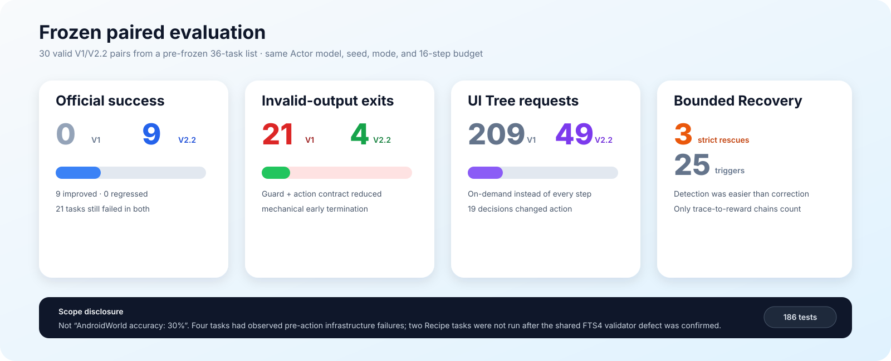
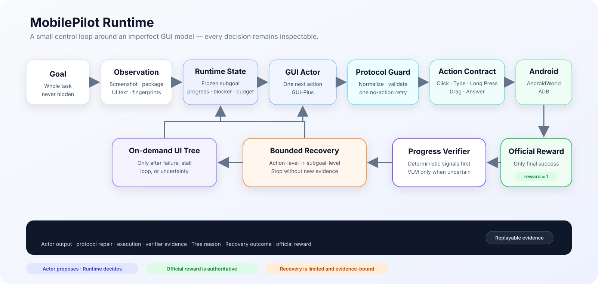
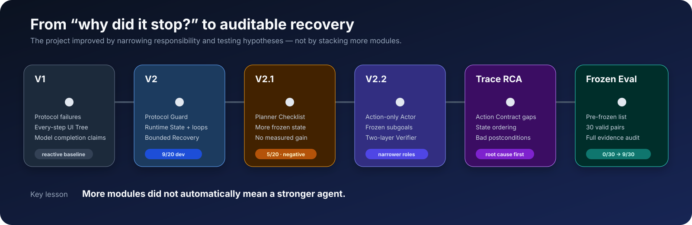
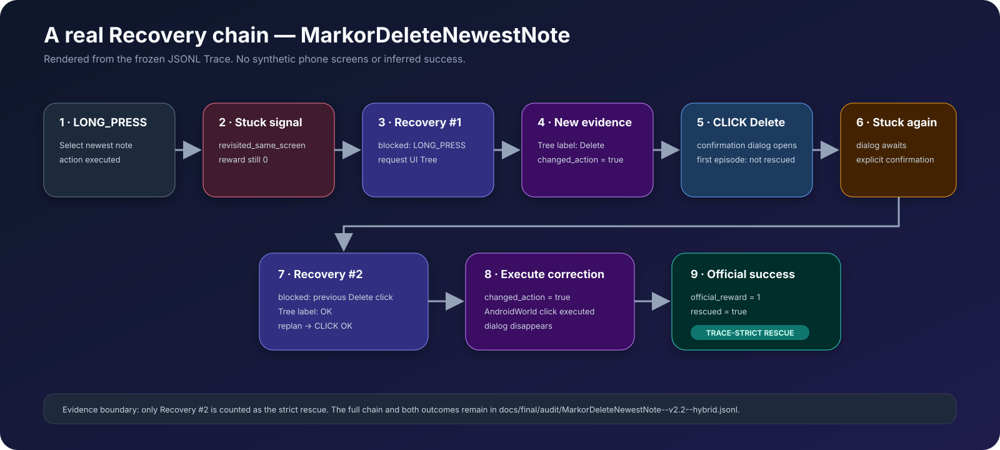

# MobilePilot

**简体中文** | [English](README_EN.md)

**可审计的 Android GUI Agent Runtime**

面向多步 Android GUI 任务的 Agent 执行框架：通过结构化动作、Runtime State、进展验证、按需 UI Tree 与有限 Recovery，让 Agent 的执行、失败和纠偏过程可追踪、可验证。

`Python` · `AndroidWorld` · `ADB` · `Android Emulator` · `uiautomator2` · `Accessibility UI Tree` · `OpenAI-compatible VLM API` · `JSONL Trace` · `pytest`

[Runtime 架构](#runtime-架构) · [冻结评测](#冻结评测) · [Recovery 案例](#一个真实-recovery-案例) · [根因分析](docs/final/v22-root-cause-analysis.md) · [Code Map](#code-map) · [完整审计](docs/final/audit/audit-summary.md)



> **结果边界：**30 个有效配对来自预先冻结的 36 题清单，**不代表 AndroidWorld 总体 30% 成功率**。其中 4 题实际观测到 Agent 接管前的基础设施失败；另 2 个 Recipe 任务在确认共享 Broccoli/FTS4 验证器缺陷后没有继续运行。

> **实验封版：**[`mobilepilot-v2.2-final`](https://github.com/qizhanggu/mobilepilot-runtime/tree/mobilepilot-v2.2-final)。当前 `main` 只在冻结实现之上整理 README、文档与展示资产。

## 从这里开始

| 你有多少时间 | 推荐阅读 |
| --- | --- |
| 2 分钟 | [项目要解决什么问题](#项目要解决什么问题) → [Runtime 架构](#runtime-架构) → [冻结评测](#冻结评测) |
| 5 分钟 | [Markor Recovery 案例](#一个真实-recovery-案例)及其[原始 JSONL Trace](docs/final/audit/MarkorDeleteNewestNote--v2.2--hybrid.jsonl) |
| 10 分钟 | [逐 Trace 根因分析](docs/final/v22-root-cause-analysis.md)、[负结果](#哪些尝试没有奏效)和 [Code Map](#code-map) |
| 完整审计 | [审计摘要](docs/final/audit/audit-summary.md)、[paired-30.csv](docs/final/audit/paired-30.csv) 和 [recovery-25.csv](docs/final/audit/recovery-25.csv) |

## 项目要解决什么问题

GUI Agent 不只是“看一张截图，然后点一下”。在真实的多步任务中：

- 模型可能输出格式错误或 Runtime 不支持的动作；
- 执行层可能缺少完成任务所需的动作能力；
- 页面发生变化，不代表任务正在向正确方向推进；
- Agent 可能重复同一个动作，或在多个页面之间循环；
- 模型可能自报完成，但环境并不认可；
- 所谓 Recovery 可能只是让同一个模型重新猜一次。

MobilePilot 在不完美的 GUI 模型外增加一个明确、可审计的控制闭环。Runtime 负责状态、协议校验、工具调用时机、恢复预算、官方成功判定和 Trace 记录；模型只提出下一步动作，不能自己改写历史，也不能给自己判分。

## Runtime 架构



| 模块 | 负责什么 |
| --- | --- |
| **GUI Actor** | 根据当前截图提出一个结构化的下一步动作。 |
| **Protocol Guard** | 归一化无歧义别名、校验 schema；仅在动作尚未执行时允许一次安全重试。 |
| **Action Contract** | 定义 Click、Type、Long Press、Drag、Answer、Back、Open App 等可执行能力。 |
| **Runtime State** | 固定当前 subgoal，维护进展证据、blocker、最近动作、循环信号和 Recovery 预算。 |
| **Progress Verifier** | 每步运行便宜的确定性检查；只有需要语义判断时才调用 VLM。 |
| **On-demand UI Tree** | 仅在协议失败、动作失败、停滞、循环或不确定时提供结构化页面证据。 |
| **Bounded Recovery** | 最多执行动作级和 subgoal 级纠偏；没有新证据时停止，而不是继续乱试。 |
| **Official Reward + Trace** | AndroidWorld reward 是唯一最终成功信号；所有关键决策和结果写入 JSONL。 |

Completion Evidence 只保留三种容易解释的类型：

- `package_activity`：目标 App 或页面上下文已经处于前台；
- `ui_text`：归一化后的目标文字出现在 UI Tree 中；
- `visual_state`：确定性证据不足，由 VLM 对比动作前后的截图。

## 项目怎么一步步演进



真正有效的升级不是继续堆一个更大的 Planner，而是把模块职责重新分清：

1. 让 Actor 保持接近训练形态：输入截图，只输出一个 GUI 动作；
2. 把 subgoal 生命周期、完成证据、循环状态和预算交给 Runtime；
3. 把动作执行前的协议修复与动作执行后的 Agent Recovery 分开；
4. 只有出现明确触发事件时，才请求 UI Tree 或语义 Verifier；
5. 只有 AndroidWorld official reward 才能结束任务并判定成功。

V2.1 的 Planner/Checklist 实验在已暴露开发集上得到 `5/20`，低于 V2 的 `9/20`。这个负结果没有被隐藏，而是直接促使项目从“增加模块”转向“厘清状态和证据”。

## 一个真实 Recovery 案例

`MarkorDeleteNewestNote` 是冻结评测中最清楚的一条“失败信号 → 新证据 → 改变动作 → 官方成功”链路。



Trace 中记录了两次 Recovery：

- Recovery #1 将失败的 `LONG_PRESS` 改为 UI Tree 提供证据的 `Delete` 点击，但此时任务还没有成功，因此如实记录为**尚未救回**；
- 确认弹窗再次停滞后，Recovery #2 从 Tree 中找到 `OK`，执行不同动作，随后 official reward 变为 `1`，Trace 才记录 `rescued=true`。

这张案例图完全由冻结 Trace 事件重建。原运行没有保存 Delete/OK 阶段的截图，因此项目没有生成假的手机界面来冒充实验截图。

**继续查看证据：**[完整 JSONL Trace](docs/final/audit/MarkorDeleteNewestNote--v2.2--hybrid.jsonl) · [自动提取的救回链路](docs/final/audit/rescue-event-chains.json) · [全部 25 次 Recovery](docs/final/audit/recovery-25.csv)

## 冻结评测

任务清单在查看结果前完成冻结。V1 与 V2.2 使用相同的 `gui-plus-2026-02-26` Actor、seed `0`、hybrid 模式和 16 步动作预算。

| 指标 | V1 | V2.2 |
| --- | ---: | ---: |
| 官方完整成功 | 0/30 | **9/30** |
| 配对改善 / 退化 | — | **9 / 0** |
| 非法输出终止 | 21 | **4** |
| UI Tree 请求 | 209 | **49** |
| Recovery 触发 / 严格救回 | 0 / 0 | **25 / 3** |
| 平均执行动作数 | 6.03 | 7.13 |
| VLM 调用数 | 209 | 386 |
| 估算目录价 | ¥1.4425 | ¥1.6521 |

这些结果能够说明：

- 在 30 个有效固定配对中，V2.2 完成了 9 个 V1 没有完成的任务；
- 机械性的非法输出死亡明显减少；
- 按需 UI Tree 的请求次数低于 V1 每步注入 Tree 的策略；
- 3 个任务具备符合严格定义的 Recovery-to-reward Trace 链路。

这些结果**不能**说明：

- AndroidWorld 总体成功率是 30%；
- 预冻结的 36 题全部形成了有效配对；
- 9 个成功全部由 Recovery 带来；
- Action Contract 兼容性补全等同于模型推理能力提升。

4 个实际观测到的基础设施失败、2 个同族排除、网络恢复批次、commit 边界和源文件哈希，均记录在[冻结评测报告](docs/final/frozen-evaluation-report.md)和[最终证据审计](docs/final/audit/audit-summary.md)中。

## 哪些尝试没有奏效

| 尝试 | 真实结果 | 决策 |
| --- | --- | --- |
| 冻结 10×10 Grid | ScreenSpot-v2 Raw `332/471`；Grid `314/471` | 在受控 App 中有效，但公开泛化退化，因此停止继续调坐标。 |
| 每步注入 UI Tree | AndroidWorld V1 hybrid `4/20`，低于 vision-only `5/20` | Tree 提供结构，不会自动产生任务规划；改为事件触发工具。 |
| Planner Checklist | 开发集 `5/20`，低于 V2 `9/20` | 更强的计划约束放大了错误假设；先解决状态与证据问题。 |

> 模块更多，不代表 Agent 一定更强。

## 证据链

| 想核对什么 | 对应证据 |
| --- | --- |
| 首页结果能否重新计算 | [paired-30.csv](docs/final/audit/paired-30.csv) · [audit-metrics.json](docs/final/audit/audit-metrics.json) |
| Recovery 是否真的执行了不同动作 | [recovery-25.csv](docs/final/audit/recovery-25.csv) · [代表性 Trace 分析](docs/final/representative-traces.md) · [3 条原始救回 Trace](docs/README.md#final-evidence) |
| 为什么 6 题没有进入分母 | [基础设施排除说明](docs/final/audit/infrastructure-exclusions.md) |
| 网络恢复后是否仍是相同冻结后缀 | [网络恢复审计](docs/final/audit/network-restart-audit.md) |
| 冻结之后是否修改 Agent 代码 | [commit boundary](docs/final/audit/audit-summary.md#commit-boundary) |
| V2.2 为什么仍有 21 题失败 | [20 题逐 Trace RCA](docs/final/v22-root-cause-analysis.md) · [代表性 Trace](docs/final/representative-traces.md) |
| 本地测试是否可复现 | [pytest 证据：186 passed](docs/final/audit/pytest-final.txt) |

## 快速开始

```bash
pip install -r requirements.txt
pytest -q
```

运行 AndroidWorld 还需要 Android Emulator、固定版本的 AndroidWorld 环境和模型 API 凭证。正式命令与安全边界见 [Demo 与复现指南](docs/final/demo-script.md)；展示阶段不应重新运行 frozen benchmark。

## Code Map

```text
mobile_pilot/androidworld/
  actor.py              GUI Actor + 结构化动作协议
  agent.py              Runtime 主循环、验证、Tree 时机与 Recovery
  runtime_state.py      subgoal 状态、循环信号与恢复预算
  subgoal_manager.py    固定 subgoal + completion postcondition
  progress_verifier.py  事件触发的语义进展验证
  adapter.py            AndroidWorld 动作与 ANSWER 适配

mobile_pilot/core/
  models.py             共享 Action Contract

scripts/
  run_androidworld_runtime_eval.py   配对评测入口
  audit_mobilepilot_v22_final.py     确定性最终证据审计
```

根目录的 `agent.py`、`agent_base.py` 和 `test_runner.py` 是为回归测试保留的 **legacy competition compatibility entrypoints**。最终 MobilePilot Runtime 位于 [`mobile_pilot/`](mobile_pilot/)。

## 当前局限

- 30 个有效冻结配对仍有 21 个任务失败；复杂表单、跨 App 任务和地图交互依然困难；
- 25 次 Recovery 只有 3 次严格救回，说明“发现异常”明显比“找到正确替代动作”容易；
- V2.2 用更多 VLM 调用、Token 和延迟换取了更少的协议型早期失败；
- 部分任务的 subgoal postcondition 生成仍然不可靠；
- 成本数字由 Trace 中记录的 Token 按目录价估算，不是实际账单。

## 文档

整理后的文档入口是 [`docs/README.md`](docs/README.md)，其中明确区分最终证据、当前设计、开发历史和旧竞赛原型。

## License

MIT。第三方模型、数据集、Android App 和 Benchmark 遵循各自许可，详见 [NOTICE.md](NOTICE.md)。
