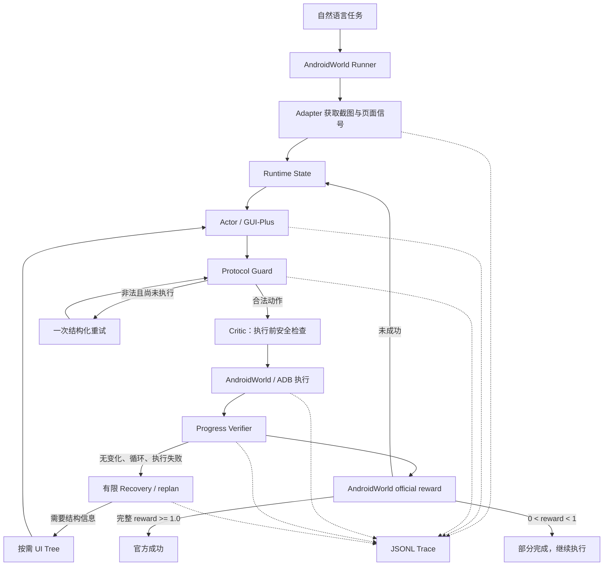

# MobilePilot 面试讲解手册

> 用途：面试前复习、面试中共享屏幕时对照讲解。正文中的“推荐说法”可以直接使用；
> “深入追问”用于面试官继续追问时展开，不需要一开始全部讲完。

## 0. 先记住这张项目事实卡

| 项目事实 | 面试时怎么说 |
| --- | --- |
| 项目定位 | MobilePilot 是可审计的 Android GUI Agent Runtime，不是训练 GUI 模型 |
| 核心闭环 | 观察截图 → Actor 决策 → 协议校验 → 执行动作 → 验证进展 → 有限恢复 |
| 主模型 | `gui-plus-2026-02-26`，评测期间固定模型以隔离 Runtime 变量 |
| 技术栈 | Python、AndroidWorld、ADB、Android Emulator、uiautomator2、Accessibility UI Tree、OpenAI-compatible VLM API、JSONL、pytest、Git/GitHub |
| 最适合写简历的结果 | 已暴露 20 题开发回归：V1 hybrid 4/20 → V2 9/20；非法输出终止 13 → 7；Recovery 10 次触发、3 次真实救回 |
| 必须说明的边界 | 20 题参与过开发，不是 held-out；新冻结子集 V1 2/6、V2 1/6，没有证明泛化提升 |
| V2.1 最新实验 | 加入 Planner、检查点、多信号 Verifier、两层 Recovery；修复后 5/20，仍低于 V2，因此是负结果，不作为简历正向成绩 |
| V2.2 最新实验 | action-only Actor + 低频 Qwen Subgoal Manager + 事件触发 Progress Verifier；最佳 7/20、1 次真实救回，仍未超过 V2 |
| 项目最有价值的点 | 从 Trace 找失败原因，把协议、状态、循环、恢复、工具调用和官方验证做成可运行、可统计的工程闭环 |

面试时优先讲稳定的 **V1 → V2** 主线。只有面试官追问“后来还做了什么”时，再讲
**V2.1 是一次没有成功超过 V2、但暴露了 Planner 成本和错误传播问题的实验**。

---

## 1. 三种时长的开场话术

### 30 秒版本

> 我做了一个 Android GUI Agent Runtime。它不是训练视觉模型，而是让现有 VLM 在手机
> 环境里能够连续观察、决策、执行和验证。我先审计了 40 条 AndroidWorld Trace，发现
> 主要失败不是单纯点不准，而是模型输出不合法、任务中途丢状态、重复动作以及误报完成。
> 所以后来我把 Protocol Guard、短期状态、循环检测、按需 UI Tree、有限 Recovery 和
> 官方 reward 验证放进 Runtime。在同一组开发回归题上，hybrid 从 4/20 提升到 9/20，
> 并记录了 3 条失败后真实救回的链路。

### 1 分钟版本

> MobilePilot 的目标是解决 GUI Agent 在多步执行中的工程可靠性问题。初版虽然能调用
> GUI-Plus 操作 AndroidWorld，但遇到一次空输出或 JSON 错误就会退出，也不知道自己是否
> 在重复动作，模型说完成时还可能误判。
>
> 我先把失败按 Trace 做了 taxonomy，然后将 Runtime 拆成 Actor、Protocol Guard、
> Runtime State、Verifier、Recovery、按需 UI Tree 和 AndroidWorld Adapter。Protocol
> Guard 只处理无歧义格式问题；Recovery 只在执行失败、连续无进展或动作循环后触发，
> 并限制恢复次数，防止在手机上乱点。最终成功必须由 AndroidWorld official reward
> 决定，模型只能提出完成建议。
>
> 在已暴露的 20 题开发回归集上，V1 hybrid 4/20 提升到 V2 9/20，非法输出终止从
> 13 次降到 7 次，10 次 Recovery 中有 3 次最终获得官方成功。新冻结子集没有复现成功率
> 提升，所以我没有把开发结果包装成泛化成绩。

### 3 分钟版本

> 这个项目最开始其实更偏手机 UI，比如坐标、网格和 UI Tree。我做完受控实验和公开
> ScreenSpot-v2 后发现，网格在自建 App 上有效，但公开数据反而从 Raw 70.49% 降到
> Grid 66.67%；AndroidWorld 里每步都塞 UI Tree，hybrid 4/20 也没有超过纯视觉 5/20。
> 这让我把重点从“再加一种视觉技巧”转向“Agent 为什么失败以后不会处理”。
>
> 我审计了 AndroidWorld 固定 20 题的 40 条运行。31 条失败里，21 条最终死于非法 Actor
> 输出，7 条耗尽步数，2 条是模型误报完成，1 条是执行失败。于是我做了三层改造：
>
> 第一层是 Protocol Guard。它负责动作 schema、坐标和无歧义别名归一化；只有动作尚未
> 执行时才允许一次结构化重试。它提升的是接口可靠性，不把它吹成推理能力。
>
> 第二层是 Agent Runtime State 和 Recovery。Runtime 保存最近完成的动作、当前子目标、
> 阻塞原因和下一步要验证什么；通过动作签名和页面指纹检测 AAA、ABAB、连续页面无变化
> 等循环。触发后重新观察，并在 hybrid 模式下按需读取 UI Tree，要求新动作与受阻动作
> 不同；预算用完就止损。
>
> 第三层是验证与审计。截图变化只代表“发生变化”，不能代表任务成功；最终成功只认
> AndroidWorld official reward。每次观察、模型输出、执行、Verifier、Recovery、Token、
> 延迟和成本都写入 JSONL Trace。
>
> V2 在同一开发集上从 4/20 提升到 9/20，并出现 3 条真实 Recovery 救回。但后来我在新
> 冻结子集上只得到 V1 2/6、V2 1/6，说明开发提升没有证明泛化。我又尝试了 V2.1 的
> Planner 和检查点，修复后也只有 5/20。这些负结果让我认识到：Planner 不是加上就会变
> 强，它可能增加 Prompt、调用和错误传播；下一步应该只在真正多约束、跨页面任务中启用。

---

## 2. 项目的主要架构



### 一次动作是怎么走完的

1. Runner 取得任务目标，并查询当前官方 reward。
2. Adapter 从 AndroidWorld 获取截图；只有需要时才把 UI Tree 元素暴露给 Actor。
3. Runtime 把总目标、剩余步数、最近动作、当前阻塞和验证目标交给 Actor。
4. Actor 返回一个结构化动作，例如 `CLICK`、`TYPE`、`SWIPE`、`OPEN_APP` 或
   `PROPOSE_COMPLETE`。
5. Protocol Guard 解析 JSON、校验字段并做有限的无歧义归一化。
6. Critic 在执行前检查坐标越界等确定性错误。
7. Adapter 将内部 `Action` 映射为 AndroidWorld `JSONAction` 并执行。
8. Runtime 再次观察页面，记录页面变化、动作历史和可能的循环信号。
9. Runner 查询 official reward：`>=1.0` 才是完整成功；组合任务的 partial reward 继续执行。
10. 全过程写入 append-only JSONL Trace，之后由评测 Runner 汇总指标。

---

## 3. 模块介绍：面试时按这张表讲

| 模块 | 文件 | 它解决什么问题 | 关键输入 / 输出 |
| --- | --- | --- | --- |
| 核心动作协议 | `mobile_pilot/core/models.py` | 隔离模型输出、Runtime 和具体环境，避免各层直接传松散字典 | `Action`、`ParseResult`、`ActionResult`、`ErrorKind` |
| Actor / Planner | `mobile_pilot/androidworld/actor.py` | 调用 GUI-Plus，把截图和状态转为结构化动作；V2.1 额外生成检查点计划 | 截图、任务状态 → 动作或计划及 Token/延迟 |
| Agent 主循环 | `mobile_pilot/androidworld/agent.py` | 串起观察、协议校验、Critic、执行、验证、循环检测和 Recovery | goal → `AgentInteractionResult` |
| Runtime State | `mobile_pilot/androidworld/runtime_state.py` | 保存有限短期状态、计算动作签名、检测循环、控制恢复预算 | 动作/页面信号 → 进度与恢复状态 |
| Subgoal Manager | `mobile_pilot/androidworld/subgoal_manager.py` | 在生命周期边界提出一个可验证子目标，不输出手机动作 | 总目标、截图、历史 → subgoal + evidence |
| Progress Verifier | `mobile_pilot/androidworld/progress_verifier.py` | 事件触发比较前后截图，输出进展分类与处置建议 | 前后图、动作、目标、证据 → 五分类 |
| AndroidWorld Adapter | `mobile_pilot/androidworld/adapter.py` | 将内部动作映射为官方 `JSONAction`，屏蔽环境实现差异 | `Action` ↔ AndroidWorld state/action |
| Screen State | `mobile_pilot/perception/screen_state.py` | 统一截图尺寸、Tree 元素、package 和多种 fingerprint | 原始观察 → `ScreenState` |
| 单任务 Runner | `scripts/run_mobilepilot_androidworld.py` | 驱动单题闭环，每步查询官方 reward，限制一次错误完成提议重试 | 任务 ID、版本、步数 → 单题结果 |
| 批量评测 Runner | `scripts/run_androidworld_runtime_eval.py` | 固定任务、模型、seed、源码 hash、设备和预算，汇总配对指标 | manifest → runs、summary、Trace |
| 测试 | `tests/mobile_pilot/` | 用 Fake Adapter/Policy 验证协议、循环、恢复和官方判定，不消耗 API | pytest 回归 |

推荐说法：

> 我没有让模型输出直接进入 ADB，而是在中间定义了稳定的 Action 协议和 Adapter。
> 这样模型协议兼容、Agent 状态机和 AndroidWorld 执行可以分别测试，也方便以后替换模型
> 或接入别的设备环境。

---

## 4. 关键技术设计

### 4.1 为什么要把 Protocol Guard 和 Agent Recovery 分开

Protocol Guard 解决的是“模型想做什么基本明确，但格式不符合接口”；例如：

- JSON 少一个无歧义括号；
- `swipe_up` 需要归一化为 `direction=up`；
- `PRESS_BACK` 需要映射为统一动作；
- 多输出了第二个 JSON 时，只取第一个完整动作。

它不能做的事情：

- 猜测被截断的输入文本；
- 猜一个可能改变任务语义的动作；
- 在动作已经执行后再次执行危险动作。

Agent Recovery 解决的是“动作虽然合法，但执行失败或没有带来进展”。它会重新观察、按需请求
Tree、把失败原因放回状态，并要求新动作与受阻动作不同。

面试官如果问两者区别，可以直接回答：

> Guard 修的是协议，Recovery 修的是策略。前者必须发生在动作执行前，后者必须由环境失败
> 信号触发。把两者混在一起，会把 JSON 兼容错误夸大成推理能力，也可能重复执行副作用动作。

### 4.2 短期状态保存了什么

`RuntimeProgress` 只保存有限窗口：

- 最近 5 个完成动作摘要；
- 最近 8 个动作签名；
- 最近 8 个不同页面指纹；
- 当前子目标；
- 当前阻塞原因；
- 下一步应该验证什么；
- 连续无变化次数。

这是有界短期状态，不是长期记忆或向量数据库。`TYPE_TEXT` 的原文不会写入进度摘要，动作签名
只保留文本 SHA-256 的短摘要，避免把用户输入直接复制到短期状态和日志里。

### 4.3 循环检测是怎么做的

当前使用简单、可解释的规则：

- 最近已执行两次相同动作，第三次候选动作仍相同：`repeated_similar_action`；
- 动作呈 A-B-A，下一候选为 B：`alternating_action_loop`；
- 连续两次页面没有有效变化：`two_consecutive_unchanged_screens`；
- 最近页面窗口中再次返回相同页面：`revisited_same_screen`。

动作签名会做适度抽象：文本输入用哈希、点击坐标按约 80 像素分桶、滑动按方向记录。这样可避免
因为坐标相差几像素就看不出重复，同时仍保持规则可审计。

局限：规则可能把“必须重复点击两次”的合法动作误判为循环，所以 Recovery 不是直接宣告失败，
而是给一次重新观察和改路机会。

### 4.4 Fingerprint 和 Verifier

V2 主要比较前后页面 fingerprint 是否变化。它能回答“页面有没有变”，不能回答“是不是朝正确
方向变化”。V2.1 为了降低状态栏时间、动画和光标带来的误报，保留了多层信号：

- `exact_fingerprint`：完整 PNG 的 SHA-256，适合审计和精确重复判断；
- `visual_fingerprint`：裁掉上下状态区域，缩放到 16×16 后形成感知位图；
- `semantic_fingerprint`：对 UI Tree 的资源 ID、文本、控件类型和可编辑状态做归一化哈希；
- `package_activity`：判断是否跨 App 或上下文。

V2.1 将变化分成：完全不变、视觉近似、有效 UI 变化、页面/上下文切换。视觉哈明距离阈值目前为
`0.035`。但这些仍只是“进展信号”，不能代替任务成功验证。

### 4.5 为什么最终成功只认 official reward

`PROPOSE_COMPLETE` 的语义是“Actor 认为可能完成”，不是 `SUCCEEDED`。Runner 会查询任务的
`is_successful(env)`：

- reward >= 1.0：即使 Actor 没说完成，也记完整成功；
- 0 < reward < 1.0：只记部分完成，继续执行剩余条件；
- Actor 说完成但 reward<1.0：拒绝这次提议，最多给一次继续机会；
- 再次误报或预算耗尽：按失败记录。

推荐说法：

> 页面变化是过程信号，模型自报是候选结论，官方 reward 才是最终标签。三者不能混用。

### 4.6 UI Tree 为什么是按需工具

V1 hybrid 每步都把 Tree 塞进上下文，结果是 4/20，没有超过 vision-only 的 5/20。Tree 提供结构
不等于提供正确规划，还会增加文本上下文和噪声。因此 V2 只在以下情况请求：

- Actor 输出非法，需要结构化重试；
- 动作执行失败；
- 连续页面无变化或检测到循环；
- Actor 明确请求 `REQUEST_UI_TREE`；
- V2.1 检查点需要 `ui_text` 证据。

Trace 会记录触发原因、Tree 元素摘要、是否改变动作、最终是否获得官方成功。

### 4.7 Recovery 为什么必须有限

GUI 操作可能有副作用，例如发送短信、删除文件、保存表单。无限重试不只是浪费 Token，还可能重复
执行危险动作。

- V2：每题最多 1 次 Recovery；
- V2.1：最多 2 次，第一次是动作级改路，第二次允许计划级修正；
- Recovery 后若候选动作仍与受阻动作相似，Runtime 在执行前停止；
- 是否“救回”必须满足 Recovery 动作实际执行，并在后续获得 official reward。

### 4.8 V2.1 的 Planner / Checklist 是怎么设计的

V2.1 的目标是给长任务增加显式 `PlanState`：

```text
✓ 打开目标 App
→ 进入编辑页
○ 填写字段
○ 保存并验证
```

每个检查点包含 `goal + frozen evidence + status`。Actor 只能提出
`PROPOSE_CHECKPOINT_COMPLETE`，不能自己把状态改成 done；Runtime 先用 UI Tree、package 等确定性
证据判断，无法确定时才允许受约束 Verifier 判断。

这套设计在代码上跑通了，但开发回归修复后只有 5/20，低于 V2 的 9/20。原因包括 Planner 输出
不稳定、简单任务被额外计划干扰、Prompt 变长、计划错误会传播到 Actor，以及检查点完成证据不够
强。因此面试时应说“我验证了这个方向当前不划算”，不能说 V2.1 已经提升任务能力。

### 4.9 Trace 和评测如何做到可审计

每题产生 JSONL，主要事件包括：

- `observation`
- `planner_decision` / `actor_decision`
- `protocol_guard`
- `critic`
- `execution`
- `verifier`
- `progress_state`
- `loop_detected`
- `agent_recovery_triggered`
- `agent_recovery_replan`
- `agent_recovery_outcome`
- `official_reward`
- `agent_finished`

批量 Runner 会汇总成功率、失败原因、动作数、循环数、Recovery 触发/救回、UI Tree 请求、VLM
调用、Token、模型延迟和估算目录价。

冻结评测前还会检查：

- 任务清单及 task hash；
- AndroidWorld commit；
- 模型、seed、步数上限和运行模式；
- Agent 源码 hash；
- 唯一设备必须是 `emulator-5554`；
- tracked workspace 必须干净；
- 调用和成本预算；
- 不覆盖已有结果，不为单题重试。

### 4.10 V2.2 为什么把 GUI Actor 收窄成 action-only

真实冒烟中，GUI Plus 被要求同时输出动作、子目标和完成证据时，4 次调用有 3 次空输出。
这说明高频 Actor 协议承担了它不擅长的管理职责。V2.2 因此拆成：

- GUI Plus 每步只输出一个 `mobile_action`；
- Qwen Subgoal Manager 只在任务开始、子目标完成或第二级 Recovery 时调用；
- Runtime 冻结 subgoal 和 completion evidence；
- package/UI 文本先走确定性验证，不足时再事件触发 Qwen Progress Verifier；
- Verifier 只返回 `progress / completed / stalled / regressed / uncertain` 和处置建议，不选动作。

开发结果最佳 7/20，低于 V2 的 9/20，但非法输出终止降到 1 次，并出现 1 次新的真实
Recovery 救回。正确说法是“职责和审计更完整，但任务成功率没有超过 V2”。

---

## 5. V1、V2、V2.1 到底有什么区别

| 能力 | V1 | V2 | V2.1 实验版 |
| --- | --- | --- | --- |
| 主模型 | GUI-Plus 固定版本 | 相同 | 相同 |
| 状态 | 简单动作历史 | 有界进度、阻塞、验证目标 | V2 状态 + 显式 PlanState |
| 非法输出 | 基本直接失败 | 无动作前一次安全重试 | 每个未执行决策点最多一次安全重试 |
| UI Tree | hybrid 每步输入 | 按需工具 | 按需工具 + 检查点证据 |
| Verifier | 页面是否变化 | 页面是否变化 + 官方 reward | exact/visual/semantic/package 多信号 + 官方 reward |
| 循环检测 | 无 | 动作重复、ABAB、页面无变化/重访 | 相同，并可进入两层恢复 |
| Recovery | 基本 wait | 最多一次动作改路 | 动作级一次 + 计划级一次 |
| Planner | 无 | 无显式整体 Planner | 结构化 Checklist |
| 开发集结果 | hybrid 4/20 | 9/20 | 修复后 5/20 |

一句话概括：

> V2 是当前实验上最可靠的 Runtime；V2.1 的架构概念更多，但效果更差，说明模块数量不等于
> Agent 能力，关键是触发条件、证据质量和额外调用是否真正转化为官方成功。

V2.2 不是在 V2.1 上继续堆 Planner，而是撤掉开场 Checklist，把高频 Actor 收窄为
action-only，并用低频 Manager + 事件触发 Verifier 管理子目标。最佳开发结果为 7/20；
更严格的 Manager 边界消融回落到 5/20+1 partial，因此该实验改动未进入最终主线。

---

## 6. 实验结果应该怎么讲

### 6.1 基线失败审计

V1 固定 20 题、vision-only 与 hybrid 共 40 条运行：

| 结果 | 数量 |
| --- | ---: |
| 成功 | 9 |
| 失败 | 31 |
| 非法输出终止 | 21 |
| 步数耗尽 | 7 |
| 模型误报完成 | 2 |
| 执行失败 | 1 |

这组审计直接决定了后续优先级：先修输出可靠性和失败恢复，而不是继续研究网格、坐标或新视觉方案。

### 6.2 V1 → V2 开发回归

固定同一模型、seed、hybrid 和 12 步上限：

| 指标 | V1 | V2 |
| --- | ---: | ---: |
| 官方成功 | 4/20 | 9/20 |
| 非法输出终止 | 13 | 7 |
| 步数耗尽 | 2 | 1 |
| Recovery 触发 / 救回 | 0 / 0 | 10 / 3 |
| 平均动作数 | 4.05 | 5.60 |
| VLM 调用 | 94 | 144 |
| Token | 421,748 | 493,719 |
| 估算目录价 | ¥0.6596 | ¥0.7969 |

正确结论：开发回归提升，说明针对这些已知失败的 Runtime 改造有效。

错误结论：不能说“AndroidWorld 整体准确率 45%”，也不能说“held-out 泛化提升 25 个百分点”。

### 6.3 新冻结子集

冻结任务、源码、模型、seed、步数和预算后，因 Joplin SQLite `fts4` 基础设施错误在第 7 题暂停，
只完成 6 个有效配对：

| 指标 | V1 | V2 |
| --- | ---: | ---: |
| 官方成功 | 2/6 | 1/6 |
| 执行动作 | 49 | 22 |
| VLM 调用 | 51 | 32 |
| Recovery 触发 / 救回 | 0 / 0 | 2 / 0 |

正确结论：V2 在这个小子集里更早止损、成本更低，但成功数没有提升。6 题也不足以代表 AndroidWorld。

### 6.4 V2.1 负结果

| 指标 | V2 | V2.1 首轮 | V2.1 修复后 |
| --- | ---: | ---: | ---: |
| 官方成功 | 9/20 | 2/20 | 5/20 |
| 非法输出终止 | 7 | 11 | 6 |
| Recovery 触发 / 救回 | 10 / 3 | 12 / 0 | 16 / 1 |
| VLM 调用 | 144 | 116 | 182 |
| 目录价成本 | ¥0.7969 | ¥0.6059 | ¥1.0298 |

修复把非法输出终止从 11 次降到 6 次，说明 Protocol Guard 有效；但 5 个成功任务全部也是 V2
已经成功的任务，没有新增能力，且调用和成本更高。

### 6.5 网格与 UI Tree 的负结果

- 自建受控 App：10×10 网格纯视觉 24/24；
- ScreenSpot-v2 Mobile 471 条：Raw 332/471（70.49%），Grid 314/471（66.67%）；
- AndroidWorld V1：vision-only 5/20，hybrid 4/20。

面试价值在于：用公开评测推翻了“网格一定更好”“Tree 越多越好”的直觉，并据此停止低收益投入。

---

## 7. 可以重点展示的 Trace

### V2 的三条真实救回

- `SystemBluetoothTurnOn`：重复相似动作 → Recovery + Tree → 改路 → reward=1；
- `SystemWifiTurnOff`：重复向下滑动 → 停止循环 → reward=1；
- `MarkorCreateFolder`：重复向上滑动 → 离开无进展路线 → reward=1。

目录：

```text
artifacts/evaluation/androidworld-v2-development-20260804/regression-20/traces/
```

### V2.1 的真实救回

`SimpleSmsReply`：第 2 步检测连续无进展，触发 action-level Recovery，Actor 改变动作，最终第 9 步
official reward=1。它证明 V2.1 Recovery 确实执行并可审计，但该题在 V2 中也成功，不能证明 V2.1
更强。

### Recovery 失败也要展示

- `MarkorEditNote`：Recovery 后改了动作，但 reward 仍为 0；
- `SystemBrightnessMax`：Recovery 后仍想重复受阻动作，Runtime 在执行前停止；
- 新冻结子集的 `SimpleDrawProCreateDrawing`：触发 Recovery 后仍失败。

推荐说法：

> 我把 Recovery 的“触发”“动作是否改变”和“最终是否被官方 reward 救回”分开统计。触发不等于
> 有效，replan 也不等于成功。

---

## 8. 面试官高频问题与推荐回答

### Q1：这个项目和普通的手机自动化脚本有什么区别？

> 自动化脚本通常预先写死操作序列；MobilePilot 的下一步动作由 VLM 根据当前截图和运行状态动态
> 决定。我的重点也不在 ADB 封装本身，而在不确定模型输出下的协议校验、状态维护、循环检测、有限
> 恢复和环境验证。

### Q2：为什么不直接用 Appium、LangChain 或 LangGraph？

> AndroidWorld 已经提供任务环境和官方动作接口，我需要控制的是每一步观察、动作预算、reward
> 查询和 Trace 事件。自定义轻量 Runtime 更容易固定实验变量和审计。LangGraph 可以表达状态图，
> 但不会自动解决页面证据、动作安全和官方 reward；当前规模引入它反而增加抽象层。未来流程更复杂
> 或存在多 Agent 分支时才值得考虑。

### Q3：为什么选择 GUI-Plus？有没有比较模型？

> 当前目标是验证 Runtime，而不是做模型排行榜，所以正式对照固定
> `gui-plus-2026-02-26`。历史上试过 GUI-Plus 主版本，但没有稳定优势且坐标约定不同。后续模型层
> 对照可以选择手机专用 AutoGLM-Phone 和一个通用 VLM 基线，但必须与 Runtime 消融分开做。

### Q4：你说成功率从 4/20 到 9/20，能证明方法有效吗？

> 只能证明对这组已经用于失败分析的开发题有效，不能证明泛化。逐题配对是 6 题改善、1 题退化、
> 3 题都成功、10 题都失败。新冻结 6 对任务里 V2 反而是 1/6，因此我没有把开发收益说成
> held-out 结论。

### Q5：9/20 看起来还是很低，项目价值在哪里？

> AndroidWorld 是真实多步任务，当前模型还会空输出、看错页面和误报完成。我不把项目定位成刷榜，
> 而是把这些失败变成可检测、可恢复、可统计的 Runtime 行为。价值包括 failure taxonomy、真实
> Recovery 链路、官方验证、冻结评测和完整负结果。低分也说明模型能力仍是上限，不能只靠 Runtime
> 包装解决。

### Q6：为什么非法输出这么多？

> GUI 模型接口偶尔返回空内容、截断 JSON、字段不完整或不支持的动作名。复杂 Prompt 和长上下文
> 也可能让输出稳定性下降。V2 的 Guard 降低了部分协议终止，但连续两次空输出仍会失败；我选择
> 保留这个边界，而不是无上限重试。

### Q7：一次安全结构化重试为什么是安全的？

> 因为第一次输出没有通过 schema，所以没有任何设备动作被执行。重试只要求模型返回合法的单一
> JSON 动作。一旦动作执行过，就不走协议重试，而是根据环境结果决定是否 Recovery，避免重复发送、
> 删除或输入。

### Q8：Recovery 具体做了什么？

> Runtime 保存触发原因和受阻动作，下一轮重新观察；hybrid 模式按需读取 Tree，并把阻塞原因加入
> Actor 上下文。新动作生成后先与受阻动作签名比较，如果仍相似就不执行。只有改变动作并最终得到
> official reward，才统计为救回。

### Q9：为什么 V2 Recovery 只允许一次，V2.1 才允许两次？

> 一次是为了控制副作用和成本。V2.1 想验证两层恢复：第一次保持目标不变只换动作，第二次允许修改
> 当前计划。但实测 16 次触发只有 1 次救回，说明简单增加预算会增加调用，不一定增加成功，所以没有
> 把两次恢复直接推广到稳定版。

### Q10：怎么判断两个动作相似？

> 先转为动作签名。OPEN_APP 看归一化 App 名，SWIPE/SCROLL 看方向，TYPE_TEXT 用文本哈希，点击
> 坐标按区域分桶。签名完全相同则视为相似。它简单可解释，但不能表达语义相似，是后续可以改进的点。

### Q11：Fingerprint 为什么不能只用截图 SHA-256？

> SHA-256 对状态栏时间、动画、光标都非常敏感，任何一个像素变化都会变。它适合审计和精确重复，
> 不适合判断语义进展。因此 V2.1 保留 exact hash，同时增加裁剪后的视觉感知指纹、Tree 语义指纹和
> package 信号。

### Q12：多信号 Verifier 能判断“方向正确”吗？

> 目前不能完全判断。它能更稳地判断无变化、轻微变化、结构性变化和上下文切换，但“是否朝任务目标
> 前进”需要任务相关证据或受约束 VLM Verifier。最终成功仍由 official reward 决定。这是当前项目
> 很明确的局限。

### Q13：UI Tree 为什么不每步都用？

> Tree 能提供控件文本和结构，但会增加上下文，动态页面里还可能过时或缺失。V1 每步使用 Tree 的
> hybrid 只有 4/20，没超过 vision-only 5/20。因此 V2 把它改成失败后或模型不确定时的按需工具。

### Q14：Planner Checklist 为什么反而让 V2.1 变差？

> Planner 自己也会空输出或生成不一致的 mode/evidence；错误检查点会约束 Actor 走错方向；简单任务
> 被额外计划干扰；同时多一次 Planner 调用和更长 Prompt 增加 Token 与延迟。说明 Planner 应按任务
> 结构触发，而不是默认每题都调用。

### Q15：如果 Planner 给错计划怎么办？

> Actor 只能提出检查点完成，Runtime 根据冻结证据确认；已经确认的检查点不能被恢复阶段修改。
> 第二层 Recovery 只替换未完成部分。若 Planner 解析失败则回退 direct 执行。但实测表明“能安全
> 回退”不等于“没有性能影响”，所以仍需要更严格的 Planner gating。

### Q16：为什么不用 Actor 自己判断检查点完成？

> Actor 既执行又给自己判分会放大误报。项目已经观察到模型错误自报完成，所以 Actor 只能 propose；
> Runtime 优先检查 Tree 文本、package/activity 等确定性证据，模糊情况才交给受约束 Verifier。

### Q17：为什么只跑 20 题或 6 题？样本够吗？

> 不够代表 AndroidWorld 总体。20 题最初用于固定基线，后来参与开发，所以只作为回归集。新冻结集
> 原计划 12 题，但第 7 题在模型调用前遇到 Joplin `fts4` 环境错误，因此只报告 6 个完整配对，绝不
> 用它推断总体。更可信的下一轮应冻结 36～48 题并只运行一次配对对照。

### Q18：12 步上限合理吗？

> 它保证 V1/V2 开发对比公平，但两道日历题的官方参考路径约 14 和 17 步，12 步确实偏紧。下一次新
> 冻结评测应让两版统一使用 18 步，而不是只给新版本加预算。

### Q19：成本是怎么统计的？

> 每次 Actor、Planner 和 Verifier 调用都记录 prompt/completion Token、延迟和按目录价估算的成本，
> Runner 再按任务和版本汇总。它是估算值，不等于账单实扣；同时有逻辑调用和总成本硬上限。

### Q20：怎么保证评测没有数据泄漏或针对单题调参？

> 任务清单先冻结并记录 hash，同时固定代码 hash、模型、seed、步数、模式和预算；运行中不查看结果
> 调 Prompt，不为单题重试，不覆盖已有产物。已经看过 Trace 的任务自动降级为开发集，不能继续称
> held-out。

### Q21：基础设施错误为什么不算 Agent 失败？

> 例如 Joplin SQLite 缺少 `fts4`，发生在任务初始化和模型调用前，Agent 根本没有机会行动。Runner
> 会记录 `infrastructure_error` 并停止整个批次，不重试该题，也不把它混入成功率分母。

### Q22：测试怎么做？

> 单元测试使用 Fake Policy 和 Fake Adapter，不依赖模拟器或 API，覆盖动作解析、协议重试、循环
> 检测、Recovery 预算、按需 Tree、检查点证据、official reward 覆盖模型自报和评测汇总。最新
> AndroidWorld 相关完整回归是 131/131 通过。端到端结果则只认模拟器中的 official reward。

### Q23：为什么不用并行跑多个模拟器？

> 当前实验协议明确只允许 `emulator-5554`，以减少设备状态和快照差异。GUI 任务还具有共享模拟器
> 状态，并行会破坏隔离。未来如果需要扩容，应为每个 worker 使用独立 AVD、端口、快照和结果目录。

### Q24：如果让你继续优化，优先做什么？

> 第一，Planner 只在多字段、多约束、跨页面和不可重复副作用任务中启用，简单任务走 V2 direct；
> 第二，使用任务证据而不是页面变化判断检查点；第三，在新的 36～48 题冻结集上做 V2 与改进版一次
> 性配对；第四，Runtime 稳定后再单独比较手机专用模型和通用 VLM，避免变量混杂。

### Q25：你个人完成了哪些工作？

> 这是个人项目。我完成了 AndroidWorld/ADB 执行闭环、动作协议和 Adapter、Actor 接口、Trace
> 审计、failure taxonomy、状态与循环检测、按需 UI Tree、Recovery、官方 reward 接入、冻结评测
> Runner、单元测试和实验文档。模型本身是外部 API，我没有训练或微调 GUI 模型。

---

## 9. 面试时不要说错的内容

| 不要这样说 | 应该这样说 |
| --- | --- |
| “AndroidWorld 准确率提升到 45%” | “在已暴露 20 题开发回归集上，hybrid 从 20% 提升到 45%” |
| “V2 提升了 held-out 泛化” | “新冻结 6 对任务没有复现成功率收益” |
| “加了 Planner，所以推理更强” | “V2.1 验证了 Planner 方案，但结果低于 V2，当前触发和证据设计仍需改进” |
| “Recovery 触发了 10 次”当成成果 | “10 次触发中 3 次最终由 official reward 确认救回” |
| “模型说完成，所以任务成功” | “模型只能提议，官方 reward 是唯一最终判定” |
| “UI Tree 能让模型理解页面” | “Tree 提供结构证据，但不会自动带来正确规划” |
| “网格让定位更准” | “网格只在受控 App 有效，公开 ScreenSpot-v2 上反而下降” |
| “我训练了 GUI Agent” | “我构建和评测 GUI Agent Runtime，模型来自外部 API” |

---

## 10. 面试共享屏幕时的展示顺序

建议只展示 5～8 分钟，不要从目录开始漫无目的地翻：

1. 打开 `README.md` 顶部：用一句话说明定位和整体闭环。
2. 展示 README 架构图：按 Actor → Guard → Execute → Verify → Recovery 顺序讲。
3. 打开 `mobile_pilot/androidworld/agent.py` 的 `step()`：说明 Runtime 主循环是真实代码，不只是架构图。
4. 打开 `mobile_pilot/androidworld/runtime_state.py`：展示循环规则和 Recovery 预算。
5. 打开一条成功 Trace：搜索 `loop_detected`、`agent_recovery_triggered`、
   `agent_recovery_outcome` 和 `official_reward`。
6. 打开 `docs/final/evaluation-summary.md`：讲开发集提升和冻结子集边界。
7. 如果面试官追问失败实验，再打开 V2.1 Sprint 13 文档。

推荐展示的文件：

- `README.md`
- `mobile_pilot/androidworld/agent.py`
- `mobile_pilot/androidworld/runtime_state.py`
- `mobile_pilot/androidworld/adapter.py`
- `docs/final/evaluation-summary.md`
- `docs/final/representative-traces.md`
- `docs/progress/androidworld-v21-sprint13-development-fix1.md`

---

## 11. 面试前至少要理解的 12 个词

| 词 | 你需要理解到的程度 |
| --- | --- |
| Agent Runtime | 管理模型观察、动作、状态、工具、验证和终止的运行框架 |
| Actor | 根据目标和当前页面提出下一动作的模型角色 |
| Protocol Guard | 在执行前解析和校验模型输出，有限修复格式问题 |
| Critic | 对候选动作做执行前规则检查；当前主要是确定性边界检查 |
| Verifier | 判断页面是否发生有效变化；最终成功仍由官方 reward 决定 |
| Recovery | 环境失败后重新观察和有限改路，不是无上限重试 |
| Replan | 根据失败证据更换动作路线或修改未完成计划 |
| UI Tree | Accessibility 提供的控件文本、类型、层级和边界信息 |
| Fingerprint | 用于比较页面是否重复或变化的摘要信号 |
| Official reward | AndroidWorld 对任务是否真正完成的权威判断 |
| Trace | 按时间记录每次观察、决策、执行、验证和恢复的 JSONL 证据 |
| Paired evaluation | 同一任务、模型、预算下比较两个 Runtime 版本，减少任务差异 |

---

## 12. 最后收尾话术

> 这个项目让我真正学到的不是“怎么让模型在手机上点一下”，而是如何面对一个不稳定、不可完全
> 信任的模型输出：先定义协议，再维护状态，用环境信号发现失败，给有限恢复机会，最后用外部真实
> reward 判定结果。我也保留了 V2.1 和新冻结子集没有提升的证据，因为 Agent 工程不应该只展示
> 成功案例，还要能说明方法在什么条件下失效。

## 13. 面试前检查清单

- 能在 30 秒、1 分钟和 3 分钟内分别讲完项目；
- 能解释 Protocol Guard 与 Recovery 的区别；
- 能画出观察—决策—执行—验证—恢复闭环；
- 能说出 V1 4/20、V2 9/20，以及为什么不是 held-out；
- 能解释 3 条 V2 Recovery 救回的判定标准；
- 能坦诚解释新冻结子集 V1 2/6、V2 1/6；
- 能解释 V2.1 为什么模块更多但只有 5/20；
- 能说明 UI Tree、fingerprint、official reward 分别解决什么问题；
- 能打开一条 JSONL Trace 找到失败信号和最终 reward；
- 遇到不会的问题时，先说明当前实现和证据，再给出下一步验证方法，不猜结果。
