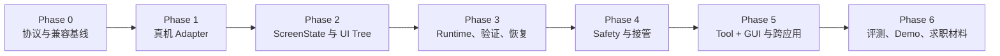

# MobilePilot 改造计划

> 项目目标：在保留现有离线竞赛基线与来源说明的前提下，将 `mobile-gui-agent` 演进为 **MobilePilot——面向真实 Android 环境的可验证、自恢复 Mobile GUI Agent**。
>
> 执行原则：先做出并验证一条真实的端到端闭环，再逐步扩展可靠性、安全性、跨应用能力与展示材料；不以堆叠 Agent、MCP、语音或前端页面作为完成标准。

## 阶段总览（一句话版）

| 阶段 | 一句话要完成的事 | 阶段出口（可验证结果） |
| --- | --- | --- |
| Phase 0：兼容基线 | 固化旧项目能力、错误语义和逐阶段评测基线。 | 原离线测试保持通过；新 Runtime 不会把异常记为成功。 |
| Phase 1：真机 Adapter + 测试 App 选择 | 只读诊断真机能力，并确定可复现的测试 App 环境。 | 设备截图与 UI Tree 可读；已有 App 已评估或 `MobilePilot Lab` 已立项。 |
| Phase 2：混合感知与策略 Adapter | 打通真实视觉与 UI Tree 的可配置组合，并接入 LegacyVisionPolicy。 | 视觉定位与语义基线均可验证；完成 ADB/uiautomator2 决策门。 |
| Phase 3：任务闭环与 Critic | 让任务拥有计划、执行前审查、验证、有限恢复和可回放 Trace。 | 自然语言任务在真机可控环境中真实完成，失败也能定位原因。 |
| Phase 4：安全与接管 | 为有副作用的操作增加风险分级、确认绑定、暂停和人工接管。 | 未确认的发送/删除/下单等动作被阻止，状态改变后旧确认失效。 |
| Phase 5：Tool + GUI | 用少量确定性工具与 GUI 操作组合，完成可解释的跨应用信息任务。 | 可生成跨应用任务结果或消息草稿，发送前必经用户确认。 |
| Phase 6：评测与求职材料 | 用重复运行、消融、Demo 与文档把真实能力沉淀为可展示证据。 | README、Trace、测试、评测和简历候选描述可以互相对应。 |
| Phase 7：可选产品化 | 在核心评测完成后，按真实需要增加语音、通知和 Android Companion。 | 产品外壳不改变 Runtime 边界，且有独立演示与说明。 |

## 1. 当前项目基线与改造边界

### 1.1 当前仓库已确认的能力

- 输入自然语言指令、当前截图和历史动作，调用视觉模型输出一个下一步动作。
- 支持旧动作协议：`CLICK`、`TYPE`、`SCROLL`、`OPEN`、`COMPLETE`。
- 使用 10×10 视觉网格、`[0, 1000]` 归一化坐标、文本化历史、输出容错和坐标后处理。
- `test_runner.py` 基于 `ref.json` 的离线状态图评测动作是否匹配预期转移；它不连接或控制真实设备。
- 当前网络无关测试共 11 项，覆盖解析、网格、坐标后处理；审计时已运行通过。

### 1.2 当前必须解决的问题

1. 没有真实 Android 设备抽象、截图获取、UI hierarchy 获取和动作执行能力。
2. 没有统一的 `observe → plan → act → verify → recover` 在线闭环。
3. 解析失败、模型调用异常目前会返回 `COMPLETE`，会把“真正成功”和“系统失败”混为一谈。
4. 现有纯视觉坐标是主要路径，缺少 UI Tree / Accessibility 元素的语义定位。
5. 没有任务状态、checkpoint、有限重试、恢复策略、风险控制和人工接管。
6. 没有可复放的结构化 Trace，也没有对重复运行结果的正式评测。

### 1.3 来源与兼容性边界

- 竞赛提供的 `agent_base.py`、离线任务格式、评测器和可视化基础设施不宣称为从零开发；其来源继续按 `NOTICE.md` 保留。
- 本轮改造新增能力会放在新的 `mobile_pilot/` 包中，避免修改未来可能被竞赛环境替换的 `agent_base.py`。
- 旧 `AgentOutput` 与旧离线评测继续通过适配层兼容；新 Runtime 不以旧 `COMPLETE` 作为最终任务成功信号。
- README、文档和简历只描述已经有代码、测试、Trace 或评测证据支持的能力。

## 2. 总体技术路线

### 2.1 执行优先级

```text
确定性 Tool / 系统能力
  → Android Intent / Deep Link
  → UI Tree 语义元素（resource-id、text、content-desc、bounds）
  → 截图 + VLM 视觉定位
  → 10×10 网格 / 归一化坐标
  → 请求用户接管或明确失败
```

这里的“优先”不是绕过安全流程：无论通过 Tool、语义元素还是坐标执行，所有动作都必须经过统一的风险检查、执行结果记录和后置验证。

### 2.2 首批目录与职责

```text
mobile_pilot/
├── core/            # Action、Result、TaskStatus、错误分类等稳定数据模型
├── device/          # DeviceAdapter、ADBDeviceAdapter、FakeDeviceAdapter
├── perception/      # ScreenState、UI XML 解析、元素引用、状态指纹
├── policy/          # 旧视觉 Agent 适配、Fake/Replay Policy、动作选择
├── runtime/         # TaskState、主循环、预算、checkpoint、暂停/恢复
├── verification/    # 后置条件、页面变化与任务成功判断
├── recovery/        # 有限重试、重新定位、弹窗/键盘处理、回退策略
├── safety/          # Risk、Approval、接管与授权范围
├── tracing/         # JSONL 事件、Trace 导出和脱敏
├── tools/           # Tool Registry、Intent/Deep Link 等确定性工具
└── cli/             # doctor、run、trace 等命令入口
```

开始时不强行建立 `memory/`、`api/`、`ui/`、语音或 Android Companion 等目录；只有核心闭环稳定且某项能力确实被实现时才增加。

### 2.3 关键技术选择

| 选择 | 方案 | 原因与当前取舍 |
| --- | --- | --- |
| 真机控制 | 第一版使用 ADB，后续按需要增加 `uiautomator2` Adapter。 | ADB 已可获得截图、XML 和基础输入，依赖更少；复杂元素交互再引入 `uiautomator2`。 |
| 设备选择 | 每次运行必须传入或确认 device serial。 | 避免多设备环境误操作用户其他手机。 |
| 模型接入 | 将现有 `Agent` 包装成 `LegacyVisionPolicy`，另有 Fake/Replay Policy。 | 最大化复用现有能力，同时让绝大多数测试不依赖 API Key 和网络。 |
| 测试环境 | FakeDevice 为默认；真机集成测试必须显式启用。 | CI 与日常测试可复现，真机不会被默认误操作。 |
| 演示任务 | 优先可控 Android 测试 App；商业 App 只用于后期演示。 | 商业 App 会受到登录、广告、版本和风控影响，不能作为稳定评测环境。 |
| 持久化 | 初期 JSONL Trace + 可序列化 TaskState；稳定后再评估 SQLite。 | 先验证运行时语义，避免一开始引入数据库迁移和一致性复杂度。 |

## 3. 分阶段实施计划

## Phase 0：兼容基线与协议纠偏

### 目标

在不破坏原有离线能力的前提下，为新 Runtime 建立明确、可测试的错误和完成语义。

### 工作内容

1. 保存当前测试结果与离线任务运行说明，记录当前能力边界。
2. 定义新的核心数据模型：
   - `TaskStatus`：`RUNNING`、`SUCCEEDED`、`FAILED`、`NEED_USER`、`CANCELLED`、`TIMEOUT`、`DEVICE_ERROR`、`MODEL_ERROR`、`POLICY_BLOCKED`；
   - `ActionType`：包含旧动作及未来的 `CLICK_ELEMENT`、`PRESS_BACK`、`WAIT`、`ASK_USER`、`PROPOSE_COMPLETE`、`ABORT`；
   - `ActionResult`：记录是否执行、执行时间、错误类别、页面状态变化与原始设备输出；
   - `ParseResult`：区分“解析成功”“格式错误”“空输出”“不支持动作”，不再隐式变成成功。
3. 编写旧协议适配器：旧 `COMPLETE` 被映射为“模型提出完成”，最终是否成功交给 Verifier 判定。
4. 为解析失败、空模型输出、API 异常、未知动作新增单元测试。
5. 更新架构文档，明确旧离线评测与新 Runtime 的职责边界。
6. 从本阶段开始保存可重复的评测产物：测试命令、运行日期、测试数量和结果；后续每个阶段在此基线上增量记录。

### 不做什么

- 不改变竞赛基类的接口。
- 不连接真机、不引入数据库、不重写现有视觉网格逻辑。

### 验收标准

- 原有 11 项网络无关测试继续通过。
- 新增测试证明：解析失败和模型异常会被记录为 `PARSE_ERROR` / `MODEL_ERROR`，不会被 Runtime 计为 `SUCCEEDED`。
- 旧离线 Runner 仍能消费原动作协议。

## Phase 1：Device Adapter、只读诊断与测试 App 选择

### 目标

安全连接指定 Android 真机，先完成只读观察和测试 App 选择；设备写操作必须在后续获得针对性确认。

### 工作内容

1. 定义 `DeviceAdapter` 抽象，覆盖：
   - 枚举与选择设备、健康检查、当前 package/activity；
   - 截图、UI XML dump、屏幕尺寸与方向；
   - tap、swipe、文本输入、Back、Home、启动 App、等待；
   - 所有调用返回结构化 `ActionResult`，不返回裸布尔值。
2. 实现 `ADBDeviceAdapter`：
   - 通过 `adb devices -l` 检查授权状态；
   - 通过 `adb exec-out screencap -p` 获取截图；
   - 通过 `uiautomator dump` 获取 XML；
   - 获取前台 package/activity；
   - 所有写操作必须绑定显式 serial。
3. 实现 `FakeDeviceAdapter`：使用离散页面状态和动作转移模拟设备，可注入“页面不变”“元素消失”“弹窗”“断连”等故障。
4. 增加 CLI：
   - `mobilepilot doctor`：检查 ADB、设备授权、serial、截图和 UI Tree；
   - `mobilepilot devices`：只展示设备，不执行操作。
5. 实现最小 `observe → act → observe`：真机执行后立即重新采集状态，验证操作调用本身和页面状态是否发生变化。
6. 前移测试 App 选择：审查用户已有 Android 小 App 的技术栈、页面、初始化/清理能力和可访问性；不满足可控评测条件时，设计极简 `MobilePilot Lab`。

### 真机操作边界

- 首次验证只做只读检查：设备列表、授权状态、截图、UI XML、分辨率和前台 Activity。
- 任何真机点击、输入、启动 App 或导航前，必须再次确认 device serial、测试 App 和具体动作。
- 不操作聊天、联系人、支付、账号设置、文件删除或任何需要登录的真实数据。
- 多台设备时没有明确 serial 直接拒绝运行。

### 验收标准

- 指定真机可以获得截图、UI Tree、分辨率和前台 Activity，且不发生写操作。
- 已有小 App 得到“可复用 / 不可复用 / 需改造”的明确结论，或 `MobilePilot Lab` 的最小页面范围已确定。
- FakeDevice 的只读观察流程可在不连接手机的情况下测试。

## Phase 2：ScreenState、视觉主链路与可配置辅助模式

### 目标

将“截图 + 坐标”升级为可配置的视觉定位层；保留结构化 UI 基线，但不把 UI Tree 写死为主路径。

### 工作内容

1. 定义 `ScreenState`，包含：
   - 截图路径或内存对象、原始 UI XML、屏幕尺寸、方向、App/Activity；
   - 语义元素列表：`resource-id`、text、content description、class、bounds、clickable、enabled 等；
   - 元素稳定引用、页面指纹、与上一个状态的差异摘要；
   - 键盘、弹窗、权限请求等可识别标签。
2. 实现 UI XML 解析与元素候选排序：
   - 首选稳定 `resource-id`；
   - 再组合 text、content-desc、class、层级与 bounds；
   - 每次候选选择记录原因、置信度与状态指纹。
3. 实现 `CLICK_ELEMENT`：执行前重新确认元素存在并将其安全中心映射到真实屏幕。
4. 保留现有 10×10 网格和归一化坐标，但改成 `CLICK_POINT` fallback。
5. 实现元素失效、旋转/分辨率变化、UI Tree 缺失、坐标超界的测试。
6. 实现 `LegacyVisionPolicy` Adapter：复用现有视觉 Agent 生成候选动作，但将其输出转换为新 Runtime 协议；同时提供 Fake/Replay Policy。
7. 在阶段末设置 ADB/uiautomator2 决策门：以已实现的真实元素定位、输入稳定性、等待能力和维护成本为证据，决定维持纯 ADB XML Adapter，还是增加可选 `uiautomator2` Adapter；记录决策和理由。

### 验收标准

- 真机上的一次点击由 UI Tree 中的元素引用完成，而非由硬编码坐标完成。
- 当 UI Tree 缺失或目标无法访问时，系统能够显式记录降级为视觉定位的原因。
- 页面变化后旧元素引用会被拒绝，而不是在旧坐标盲点。
- 已完成 ADB/uiautomator2 决策记录；不会为了“技术栈丰富”而无依据地引入依赖。

## Phase 3：可验证任务 Runtime、Pre-action Critic、恢复与可控 Demo

### 目标

完成第一条真正可运行、可测试、可解释的自然语言任务执行闭环。

### 工作内容

1. 实现 `TaskState`：原始目标、当前 subgoal、步骤预算、重试次数、当前/历史 `ScreenState`、动作、结果、checkpoint 与终止原因。
2. 实现基础 Planner：简单任务不强行拆成复杂计划；多步任务拆成带前置条件和成功条件的 subgoal。
3. 将现有视觉 Agent 封装为 `LegacyVisionPolicy`，其角色从“唯一执行器”改为“产生候选动作的视觉策略”。
4. 提供 `FakePolicy` 与 `ReplayPolicy`，使 Runtime、Verifier 和 Recovery 的主测试不依赖模型调用。
5. 实现轻量 Pre-action Critic：在执行前检查动作是否服务当前 subgoal、目标状态是否仍有效、是否存在更可靠的结构化路径、是否重复/可能循环、expected outcome 是否可验证；它输出确定性结构化判定，不形成无限反思。
6. 实现 Verifier：优先用 App/Activity、UI Tree、文本值、页面差异判断动作后置条件；`PROPOSE_COMPLETE` 必须经最终成功条件验证。
7. 实现有限 Recovery 阶梯：
   ```text
   等待页面稳定
   → 同一动作有限重试
   → 重取 UI Tree 并重新定位
   → 处理已知弹窗或软键盘
   → Back 回到 checkpoint
   → 局部重新规划
   → 请求用户接管或明确失败
   ```
8. 实现 JSONL Trace：每一步保存观察摘要、候选动作、Critic 结论、选择来源、执行结果、验证结果、恢复决策和终止原因。
9. 基于 Phase 1 的 App 选择结论，使用已有小 App 或创建 `MobilePilot Lab`，提供搜索、筛选、列表、弹窗和提交前确认页面。

### 首个代表任务

> “打开 MobilePilot Lab，搜索咖啡，筛选评分 4.5 以上，并读取前三个结果。”

该任务保留 `tree_first` 作为可靠基线，同时建设 `vision_only` 与 `vision_with_tree_aux`；视觉结果和 UI Tree 结果必须分开记录，不能混合成一个成功率。

### 验收标准

- 真机上该任务可完整执行；最终结果由 Verifier 而不是模型自报判断。
- 通过 FakeDevice 覆盖页面无变化、元素消失、弹窗、输入失败和有限重试。
- 任一次失败都能从 Trace 判断问题发生在感知、策略、设备执行、验证还是恢复。

## Phase 4：安全、确认与人工接管

### 目标

为有副作用的移动端任务建立不能被模型绕过的安全边界。

### 工作内容

1. 实现统一风险分级：
   - R0：观察；
   - R1：导航、搜索、滚动；
   - R2：填写/编辑但未提交；
   - R3：发送、提交、上传；
   - R4：删除、账号/权限改动、敏感信息写入；
   - R5：下单、支付、密码、验证码、生物认证。
2. 实现 `SafetyGate`：R0/R1 可自动执行；R2 需可预览；R3 必须确认；R4 默认拒绝或独立强确认；R5 只能导航到最终确认页并请求用户接管。
3. 设计 `Approval` 绑定：动作、目标、参数、收件人/金额、ScreenState 指纹与有效期缺一不可。
4. 实现暂停、继续、取消、紧急停止与接管后重新观察。
5. Trace 与 Memory 默认脱敏：密码、验证码、Token、聊天内容和联系人信息不得进入长期保存。

### 验收标准

- 未确认的发送、删除、下单动作被阻止且记录为 `NEED_USER` 或 `POLICY_BLOCKED`。
- 已确认后如果页面、金额或接收人变化，旧确认立即失效。
- 用户接管后系统可重新采集状态再继续，而不会执行接管前的陈旧动作。

## Phase 5：Tool + GUI、任务记忆与跨应用任务

### 目标

证明系统不仅会点手机，还会在合适位置选择更可靠的确定性能力。

### 工作内容

1. 实现轻量 `ToolRegistry`：每个 Tool 声明输入输出、风险、副作用、幂等性、超时和后置条件。
2. 先接入少量有用能力：读取设备状态、启动 App、Intent/Deep Link，以及一个只读信息型 Tool。
3. 增加 Task Memory：仅保存当前任务计划、已验证结果、checkpoint 和必要事实；不默认持久化敏感内容。
4. 在经过多次验证后，才将稳定路径抽象为 Tips/Shortcut；Shortcut 仍要逐步验证关键 checkpoint。
5. 完成跨应用信息草稿 Demo，例如“查询信息后整理为待发送消息草稿”，真正发送前必须进入 Phase 4 的确认流程。
6. 对纯 GUI 与 Tool + GUI 记录步骤数、调用次数、延迟、Token 和成功情况；数据由实际脚本生成。

### 验收标准

- 至少一个跨应用任务利用确定性 Tool 与 GUI 协同完成。
- 任务结果、草稿和 Trace 可查看；消息不会在没有确认的情况下发送。
- 所有 Memory/Shortcut 都能说明来源、适用条件和最后验证时间。

## Phase 6：核心评测、Demo、文档与求职材料

### 目标

把真实运行能力沉淀为面试可讲、可核验、不过度包装的项目证据。

### 工作内容

1. 建立可控任务集与重复运行脚本，保存每次任务的配置、设备、日期、Trace 和结果。
2. 计算真实指标：任务成功率、subgoal 完成率、验证准确性、恢复成功率、风险阻止率、步骤数、延迟与失败类别。
3. 完成少量高价值消融：
   - vision-only / UI Tree-only / hybrid；
   - grid on / grid off；
   - Verifier/Recovery on / off；
   - pure GUI / Tool + GUI。
4. 补齐文档：架构、混合执行、安全、评测、失败分析、设计决策、面试讲解。
5. 录制真机 Demo；商业 App 的单次演示与可控 App 的重复评测分开呈现。
6. 生成简历候选描述，但只有在评测产物真实存在后才填入任何指标。

### 验收标准

- README 明确区分比赛基础、既有实现和本轮新增实现。
- 每一个对外宣称的能力均可定位到代码、测试、Trace 或评测结果。
- 用户可以独立按文档复跑可控 Demo，至少获得相同的任务终止语义和 Trace 结构。

## 4. 执行顺序与依赖



- Phase 0 完成后即可开始真机只读诊断。
- Phase 1 的低风险真机操作依赖设备已经开启 USB 调试并授权当前电脑。
- Phase 3 的正式端到端验收依赖一个可控测试 App；优先评估用户已有小 App 是否可复用。
- Phase 4 必须在任何“发送、删除、下单、支付”等有副作用的 Demo 前完成。
- Phase 5 的 Tool 与 Memory 不得绕过 Phase 4 的统一安全 Gate。

## 5. 真机使用与用户配合节点

### Phase 1 开始前

用户需要：

1. 在 Android 手机上开启开发者选项和 USB 调试；
2. 用 USB 连接当前电脑，并在手机上确认 RSA 调试授权；
3. 告知是否可先执行只读检查（设备列表、截图、UI Tree、前台 Activity）；
4. 后续执行动作时，提供要操作的测试设备 serial，避免误操作其他设备。

### Phase 3 开始前

需要共同决定：

- 复用用户之前开发的小 App：先审查其技术栈、页面和可控性；或
- 创建新的 `MobilePilot Lab`：仅实现支撑 Agent 测试的最小页面，不追求完整产品。

选择标准是“能稳定初始化、能确定性判断成功、能清理状态”，而不是 UI 是否美观。

## 6. 明确后置的能力

以下能力有价值，但在核心闭环跑通前不启动：

- 多模型、多 Provider 接入；
- MCP Server 的泛化集成；
- FastAPI/Web 看板；
- iOS 支持；
- 自动探索、强化学习和大规模 Memory；
- 商业 App 的成功率评测。

它们的共同前提是：系统已经能在可控 Android 环境中可靠执行、验证、恢复并输出 Trace。

## Phase 7：可选产品化（核心评测完成后）

### 目标

在不改变 Host Agent Runtime 与安全边界的前提下，为已验证的核心任务增加更易展示和使用的外壳。

### 工作内容

1. 语音任务入口：语音只负责转文字，用户可校正结果，始终保留文本输入 fallback。
2. 任务通知：仅推送简短状态，不包含敏感页面、验证码、联系人或支付信息。
3. Android Companion：创建任务、查看进度、确认高风险动作、发起或结束接管；明确表述推理和设备控制仍运行于 PC/Host Agent。

### 验收标准

- 语音、通知或 Companion 中任一能力均通过独立演示验证，但不被表述为项目核心可靠性创新。
- 所有高风险确认仍由 Phase 4 的统一 SafetyGate 处理。

## 7. 每阶段汇报模板

每完成一个阶段，按以下格式汇报：

1. 新增的真实用户能力；
2. 关键模块与接口；
3. 新增测试和实际通过结果；
4. 真机/模拟器验证结果（若尚未具备条件则明确说明）；
5. 新增 Trace 或评测产物；
6. 当前可运行 Demo；
7. 已知失败案例、技术债和风险；
8. 与原离线比赛原型相比的真实增量；
9. 下一阶段及其必要性。

## 8. 当前获批后立即执行的第一步

获批后先执行 **Phase 0**，产出核心 Schema、旧协议适配、错误语义测试和基线文档；完成后再进入 **Phase 1** 的 ADB 只读诊断。

在 Phase 1 开始执行任何真机写操作之前，会再次明确列出目标设备、具体动作和风险等级。
